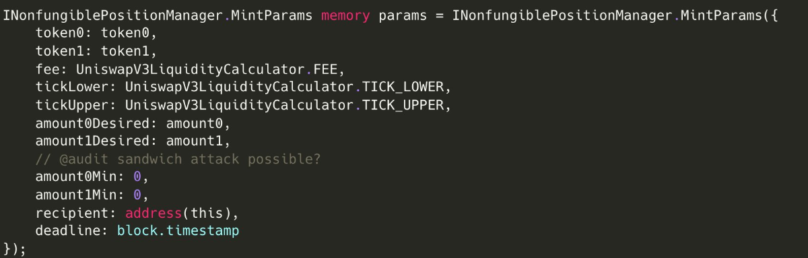

# 1 GNOSIS SAFE AND CLONING

Lets start by talking about the idea of cloning which is what velvet use to create portfolios. They create portfolios using PortfolioFactory::\_createPortfolio and if you look in that function, you will see a whole lot of proxies deployed with implementation contracts passed to them as well as data to call for some of them. We are already used to ERC1967 proxies so you should fully understand what is going on here. I talk about it breifly in FunctionParameters.sol where i said in the natspec it says Base Portfolio contract address for cloning which implies that there are base contracts that are used for portfolios and when someone creates a portfolio, they use one of the available templates(implementation contracts) and all that happens is that they create a proxy contract with the base contract as the implementation. we already know how proxies work so this makes sense as the proxy contains all the storage for that particular user's implementation which is what makes it a clone.

So the idea of cloning is pretty much that and my guess is that they got this idea from gnosis safe which they also implemented. Gnosis safe provides contracts that can be used to create multisigs where multiple signers are necessary to approve any transaction. In the \_createPortfolio function, GnosisDeployer.\_deployGnosisSafeAndModule is called which is what creates the multisig so lets look at how the multisigs are created.

For Gnosis, it all starts with the safe singleton factory which you can find at: https://github.com/safe-global/safe-singleton-factory/blob/main/contracts-zk/SafeSingeltonFactory.sol.

The idea is that gnosis use this factory contract to deploy a singleton contract to each chain. They use create2 opcode to make sure the address is the same on every chain and they talk about this in the README in the github I linked above. These contracts are deployed by gnosis once on every chain. Look into networkVariables.ts to see the singleton address. it is "0x3E5c63644E683549055b9Be8653de26E0B4CD36E". If you go on etherscan or arbiscan or any block explorer and type this address and inspect the code, you will see that this is the singleton address and all this code contains is what actually powers the multisigs to work. You can go through all that code yourself. You will see an execTransaction function as well as a bunch of other interesting stuff you should look at. The safe documentation does a great job of explaining all the contracts inside a singleton contract and I have linked the documentation below. We are only covering how the infrastructure of gnosis works with this cloning idea.

Now we have this, the next thing to look at the safe proxy factory which is imported in the Gnosisdeployer.sol library in this repository. I searched for the actual package and you can see it at: https://www.npmjs.com/package/@gnosis.pm/safe-contracts?activeTab=code

In the link above, you can review the code and this is exactly where the cloning idea takes shape. The idea is that this safe proxy factory can be used to deploy a proxy contract that points to the singleton contract as its implementation contract. Sound similar ? Well that would be because that is the exact same thing that velvet-v4 is doing which is why i said im am at least 80% sure they got the idea from gnosis. You can read about the whole flow in the safe docs at https://docs.safe.global/advanced/smart-account-overview#safe-proxy-factory

So the safe proxy factory deploys a proxy with the singleton address as its implementation. So any proxy contract deployed is essentially an instance of the main singleton contract deployed by gnosis. So in the gnosisdeployer.sol library, the following line is there:

```solidity
GnosisSafe _safe = GnosisSafe(
      payable(
        gnosisSafeProxyFactory.createProxy(params._gnosisSingleton, bytes(""))
      )
    );
```

If you look in the npm link i sent above, you will see the createproxy function does exactly what i said it did, it creates an instance of the main singleton contract which is then stored in the \_safe variable which has the same abi as the GnosisSafe which makes sense because it is exactly the same as the GnosisSafe singleton contract originally deployed by Gnosis. You can also see this in the safe documentation i sent above where it talks about Safe and says "This is a singleton contract deployed only once and used by Safe Proxy to delegate calls. It is the main contract that holds the logic for signature verification, executing transactions, managing owners, modules, and the fallback handler. As a singleton contract, it cannot be used directly as a Safe account but only through a Safe Proxy contract."

Now we need to introduce the concept of modules. The singleton contract contains many other contracts as the safe docs say and one of those is a modulemanager.sol and it allows people to create modules which are simply contracts that have custom logic that can be run on the safe. Usually, all logic inside the safe can only be run by the addresses set up as owners in the portfoliofactory contract so it requires everyone set up in that array to sign the transaction for it to go through.

The module creates another path that allows people to send transactions via the safe without necessarily having to go through all the signers. In the singleton contract, there is a function called execTransactionfrommodule in the ModuleManager.sol contract which as we discussed, is one of the contracts in the singleton contract. execTransactionfrommodule which is a function that any configured module can call to bypass the normal execTransaction function that is used in the singleton contract. You can go have a look at that function to know more about how it works but it is pretty straightforward. This module is simply any contract that anyone can create and put some logic in it and for it to count as a module in gnosis, all they have to do is call the enablemodule function in their singleton contract instance and it will add the contract to their module.

You can see where Velvet did this in the gnosis deployer in GnosisDeployer::\_deployGnosisSafeAndModule

```solidity
VelvetSafeModule _gnosisModule = VelvetSafeModule(
      Clones.clone(params._baseGnosisModule)
    );

     bytes memory _enableSafeModule = abi.encodeCall(
      IGnosisSafe.enableModule,
      address(_gnosisModule)
    );
```

That clone function comes from a clones contract from openzeppelin that as the name suggests, creates a clone of whatever contract is passed to it. Similar to using a proxy but when looking at the clone function, it does some low level assembly to create a copy of the contract. I am guessing that the idea is that it takes the logic solidity uses when creating a proxy and tries to gas optimize it. I can easily see this by making a minimal contract that creates a proxy and see what opcodes solidity uses to do it and compare it to what is done in the clone function to see the difference but that is something I can do later. For the purposes of this audit, it is safe to assume it works as intended but i can come back and explore this for learning purposes.

Anyway, you can see the \_enableSafeModule which turns the call to bytes and then does some more stuff to add more calls and then calls the following function:

```solidity
 _safe.setup(
      params._owners,
      params._threshold,
      params._gnosisMultisendLibrary,
      _multisendAction,
      params._gnosisFallbackLibrary,
      address(0),
      0,
      payable(address(0))
    );
```

and in this setup function is the \_multisendAction which contains the \_enableSafeModule and you can see all of this in GnosisDeployer.sol so you can have a look there.

You can read more about safe modules with the following links which explain it extremely well:
https://docs.safe.global/advanced/smart-account-modules
https://youtu.be/nmDYc9PlAic

With this, you have a good high level understanding of how gnosis works and how velvet uses it. It is a good idea in your spare time to go into the contracts that a singleton uses and see what it contains as it can help you understand a lot of whats going on. Have a look at the contract address for the singleton i sent earlier and view the contract on etherscan.

# 2 INTERNAL REVERT EXPLOIT, ABI.DECODE ISSUE AND HOW TO CAUSE FUNCTIONS THAT SHOULDNT REVERT TO REVERT , RATTLE

https://medium.com/@0xdeadbeef0x/the-double-edged-sword-of-abi-decode-f81529e62bcc

Velvet use abi.decode in their VelvetSafeModule which triggered me to have a look at a bookmarked tweet I had about abi.decode to see if i could use that to exploit this protocol. The answer is not really as of yet but knowing about this will help you be able to hack almost any function that has logic that MUST not revert.

So you already know protocols with liquidation logic or any other logic where they ideally dont want the logic to revert under any other circumstances so they use try/catch blocks which i have already covered how to also exploit in a situation where the information in that try/catch block is necessary protocol logic

Anyway, lets look at how we can use abi.decode.To understand this, we first have to look at hoe solidity handles custom errors:

Solidity has released a blog post detailing how to efficiently revert with a custom reason. The blog post includes an example assembly block that can be used to return a custom error message:

```
let free_mem_ptr := mload(64)
mstore(free_mem_ptr, 0x08c379a000000000000000000000000000000000000000000000000000000000)
mstore(add(free_mem_ptr, 4), 32)
mstore(add(free_mem_ptr, 36), 12)
mstore(add(free_mem_ptr, 68), "Unauthorized")
revert(free_mem_ptr, 100)
```

Load the next available address from the free memory pointer.
bytes 0-32: The selector of “Error(string)” to the first 32 bytes (0x08c379a0).
bytes 4–36: The offset to the length of the error string (32).
Bytes 36–68: Length of the string (12).
Bytes 68–100: The string itself (“Unauthorized”).

So I am sure from your assembly course, you can guess what is going on here but there are some nuances that need to be clarified.

let free_mem_ptr := mload(64)
🔹 mload(64) → Loads the free memory pointer (default location 0x40 in memory). This point is very important because in evm.codes, if you search for MLOAD, you will see that it takes the offset from the stack and returns the value which is what happens here. We know that solidity stores 0x80 in 0x40. So essentially the line says free_mem_ptr = 0x80 but this isnt a regular assignment. This is a pointer. Since we are loading from memory, what happens is that free_mem_ptr will now point to 0x80's location in memory. So you know how storage pointer's work, this is the equivalent idea in memory. So we aren't pointing to a raw value, we are pointing to a location

🔹 free_mem_ptr now holds the start of free memory, where we’ll store error data.

mstore(free_mem_ptr, 0x08c379a000000000000000000000000000000000000000000000000000000000)
🔹 Stores the error function selector (0x08c379a0) at free_mem_ptr.
🔹 0x08c379a0 is the 4-byte function selector of Error(string), which is the standard way Solidity returns string-based errors. So when trying to store custom errors in solidity, we need to fist store the selector of Error(string) in memory. This is just how solidity works and 0x08c379a0. We already know how selectors work but see below for a recap if you forgot.

keccak256("Error(string)")[:4] == 0x08c379a0
This is the function signature Solidity uses for string-based reverts.

So the idea is that whenever you see an error message returned in solidity. Say we had this simple contract:

```solidity
// SPDX-License-Identifier: MIT
pragma solidity ^0.8.0;

contract SimpleBank {
  mapping(address => uint256) public balances;

  event Deposit(address indexed user, uint256 amount);
  event Withdraw(address indexed user, uint256 amount);

  error InsufficientBalance(uint256 available, uint256 requested);

  function deposit() external payable {
    balances[msg.sender] += msg.value;
    emit Deposit(msg.sender, msg.value);
  }

  function withdraw(uint256 amount) external {
    if (amount > balances[msg.sender]) {
      revert InsufficientBalance(balances[msg.sender], amount);
    }

    balances[msg.sender] -= amount;
    payable(msg.sender).transfer(amount);
    emit Withdraw(msg.sender, amount);
  }

  function getBalance() external view returns (uint256) {
    return balances[msg.sender];
  }
}
```

In the withdraw function, if that revert ever hits, this is what solidity does in the EVM. It pushes the length of the payload (all data related to the error message) to the stack and then it pushes the selector of Error(string) which we are talking about in this point and that selector is 0x08c379a0. It adds it as 32 bytes so appends a bunch of 0's at the end. So now you know that if you ever see 0x08c379a0 in any data, you know that it is an error. Then solidity pushes an offset to the string, the length of the string and then the actual string which in this example would be the string "InsufficientBalance". All of this will be explained in more detail below so continue reading.

mstore(add(free_mem_ptr, 4), 32)
🔹 Stores 32 (offset) at free_mem_ptr + 4. So this opcode is simply adding 4 bytes to 0x80 and storing the decimals value of 32 there. As we have learnt from the assembly course, each memory slot is 32 bytes but we are writing to 0x84 which is only 4 bytes after 0x80 so you might be thinking, arent we overwriting the 0x80 slot and the answer is yes we are. The idea is that we want to form all the data that forms the error message and this data contains the following:

- Error(string) selector
- Offset that tells solidity where string is (will explain more below)
- Length of string
- actual string

These 4 things come together to form the data we want to send that produces the custom errors you see in solidity. So as we know, forming data in bytes is just getting all this information in bytes and concatenating it. This is how calldata is formed as you know.

So far in memory, we only have the selector padded with a bunch of zeros after the 4th byte so we want to add the next bit of info into memory which is adding 32. So why do we add this 32, if you look at the list of info we need to add to this custom error, we add the offset and all this does is tells solidity how many bytes to skip to get the actual string we want to return. We want to skip 32 bytes because the next bit of info is the length of the string which is going to take 32 byes, we need to tell solidity to skip these 32 bytes and go to the next 32 bytes to get the actual string.

mstore(add(free_mem_ptr, 36), 12)
🔹 Stores 12, which is the length of the error message "Unauthorized".
🔹 36 = 4 (selector) + 32 (offset to string length), so we are now at the correct location for storing the length.

mstore(add(free_mem_ptr, 68), "Unauthorized")
🔹 Stores the string "Unauthorized" at free_mem_ptr + 68 which as I said above, this string at 0x80+0x3c(68in decimals) is 32 bytes after the offset we stored. So the 32 bytes after the offset contains the length of the string but after that, is the actual string and that is what the offset is telling solidity by storing 32.

Lets talk about that add opcode for a bit. you know what the add opcode does already. it adds 2 values together and then we use MSTORE to say go to that offset (location in memory) and store "Unauthorized".

🔹 68 = 36 + 32 (we need to skip 32 bytes because strings in Solidity ABI are stored with their length first).

revert(free_mem_ptr, 100)
🔹 Reverts execution and returns the error data starting from free_mem_ptr, with a total length of 100 bytes.

Why 100 bytes?

| Offset    | Data Stored                      | Size (bytes) |
| --------- | -------------------------------- | ------------ |
| `0`       | Function selector (`0x08c379a0`) | 4            |
| `4`       | Offset to data (`32`)            | 32           |
| `36`      | String length (`12`)             | 32           |
| `68`      | `"Unauthorized"` (padded)        | 32           |
| **Total** | **100 bytes**                    | **100**      |

What Happens During Execution?
The program manually encodes the revert error message.
The EVM reads it as a standard Solidity revert (Error("Unauthorized")).
The revert(free_mem_ptr, 100) halts execution and returns the encoded error.

Equivalent Solidity Code

revert("Unauthorized");
The above assembly is just the manual, low-level way of doing this.

Now you understand this, lets go a step further to see where this can be exploited.

It is common to parse the revert reason at the caller function using the following implementation. This implementation can be found in popular protocols such as UniswapV3:

(bool success, bytes memory result) = address(target).call(data);

if (!success) {
// Next 5 lines from https://ethereum.stackexchange.com/a/83577
if (result.length < 68) revert();
assembly {
result := add(result, 0x04)
}
revert(abi.decode(result, (string)));
}
In the code snippet above, the data returned by the low-level call is pointed to in “results” and the code adds 4 bytes to the offset of the results pointer.

This step is necessary to align the data so abi.decode will be able to decode the revert reason string and ignore the 4 bytes selector “0x08c379a0” which is the selector for “Error(string)”.

This looks pretty ok so far and will actually work perfectly for abi.decode but lets look where the problem is. In a low level call, we already know that the bool and bytes memory are returned but what you didnt know is that the data returned in the bytes memory data type is padded with the length of the data. Let me explain what this means. So before the shift the result memory pointer by 4 bytes, this is what it looked like :

```
[0] 0000000000000000000000000000000000000000000000000000000000000064
[1] 08c379a000000000000000000000000000000000000000000000000000000000
[2] 0000002000000000000000000000000000000000000000000000000000000000
[3] 0000000c556e617574686f72697a656400000000000000000000000000000000
[4] 0000000000000000000000000000000000000000000000000000000000000000
```

So like i said above, whenever a variable is declared with bytes memory, the data that is returned is padded with 32 bytes containing the length of the data which is in dex 0 as 0x64 which is 100 in decimals which is correct as we know that the byte length is 100 bytes and then rest of it is the actual data returned which we went over above. As we know, each index is 32 bytes which is why the data is formatted like that.
in index 1, there are 32 bytes and these bytes contain the selector of Error(string) which is 4 bytes and the 32 bytes containing the offset which is 32 (20 in hex). So those 36 bytes are as we expect. This is then followed by the length of the string and then the actual string which is stuff we already know.

What happens after we do result := add(result, 0x04) ?

WE already know that this sets the free memory pointer to 4 bytes ahead. so when we pass this new result memory pointer to abi.decode, this is what solidity is reading:

```
[0] 0000000000000000000000000000000000000000000000000000006408c379a0
[1] 0000000000000000000000000000000000000000000000000000000000000020
[2] 000000000000000000000000000000000000000000000000000000000000000c
[3] 556e617574686f72697a65640000000000000000000000000000000000000000
[4] 0000000000000000000000000000000000000000000000000000000000000000

```

So now, what happens is that we are reading 4 bytes ahead of the memory location we were reading from which removed a bunch of zeros but completely messes up the format of the result. Let me explain why protocols do this in the first place. The reason is that when passing data to abi.decode, solidity reads index 1 and is expecting it to say where the offset of the string is. So how many bytes it has to skip to get to the string. In the last result memory pointer, in index 1, there was the function selector which wont work with abi.decode. So what protocols do is to point to 4 bytes ahead which moves the selector into index 0 and leaves the offset in index 1 which is correct but what they ignore is that the first 32 bytes that represents the length of the data is now 0x6408c379a0 (429643757984 in decimals) which is incorrect and an incredibly large number. So if any calls after depend on the data in index 0, they are fucked because this returns an absurdly large number.

This is just one of the issues and highlights why you have to be EXTREMELY careful when using memory pointers. Lets dive into the big issue though. Remember we are trying to get a function in a protocol that 'handles' errors in try catch blocks.

What have we learned so far?

Called contracts can revert with any arbitrary return data which means that the protocol makes a low level call to an arbitrary contract and we know that this arbitrary contract can define ANY custom error to return to the calling contract.

Shifting the “Error(string)” selector increases the size of the bytes to a large value.

What can go wrong?
Many protocols incorporate relayers or keepers that execute transactions and callbacks and get paid for the execution cost. These roles typically require that the called callbacks will not revert. Protocols implement validation checks to ensure this.

An example of how a vulnerable protocol would look like:

```
contract Protocol {
    event CallbackFailed(string reason);

    function executeSomethingForUser(address callback) external {
        try ICallback(callback).callbackFunc(0) {
        } catch (bytes memory reasonBytes) {
            // Next 5 lines from https://ethereum.stackexchange.com/a/83577
            if (reasonBytes.length < 68) revert();
            assembly {
                reasonBytes := add(reasonBytes, 0x04)
            }
            emit CallbackFailed(abi.decode(reasonBytes, (string)));
        }
        // Get paid for execution
    }
}
```

Although decoding the revert reason may appear to work as expected, there is a vulnerability that can be exploited. Specifically, if an attacker can cause the abi.decode function in the catch block to revert or consume a significant amount of gas, it could lead to a vulnerability where the user controls when the execution succeeds or drains caller funds and we will look at how both can happen.

Solidity ABI decoder is hard to understand from the source code level. It is easier to disassemble the bytecode to understand exactly how it works.

There are some opcode repetitions that we can ignore and using rattle will help us perform binary static analysis in a readable way. This article is the first place i heard about rattle. Usually, decoding bytecode, i would run evm.codes playground and run through the opcodes stepping through each one but there is this tool called rattle which you can install at https://github.com/crytic/rattle.

This tool is too good as it removes the need to look at random opcodes like pops, swaps, etc, it simply shows you the flow of the opcodes that really matter and the paths that they can take. This is a must use tool from now on and will make your decompiling bytecode SO much easier. Once you get the gist of it, it is pretty easy to understand and this is a tool you must use from now on. Start by decompiling the below contract and go from there. I will cover exactly how to use this tool in my assemblyandfvcourse so go have a look there to see how I do it.

We will disassemble the following contract to understand how abi.decode works:

```solidity
pragma solidity 0.8.17;

contract test {
  function testDecode() external {
    bytes memory result = abi.encode("aaaa");
    abi.decode(result, (string));
  }
}
```

Remember, our goal is to identify how to make abi.decode:

1. Revert.
2. Consume a large amount of gas.

So lets see how we can cause an internal revert.
According to the assembly, the three revert paths revert when:

- Offset to payload is less then 32 bytes.
- Offset to the payload is larger then 0xffffffffffffffff which is the end of. the memory stack of the evm (uint64).
- Offset to the payload is larger then the encoded data length + 0x1f.

So the article took that simplifies contract that tested abi.decode and looked at the bytecode and looked at every way that a revert could occur. Using rattle makes this job a whole lot easier than we would using evm.codes playground or the foundry debugger. Rattle will show you all of the attack paths. Do this yourself to see that what they are saying is true.

Where it says offset to payload is pretty much the offset we entered that points solidity to the string we stored after the string length.

A malicious actor can store any value that meets one of three reverts path in the return data to make abi.decode revert.

Example of leveraging #2:

let free_mem_ptr := mload(64)
mstore(free_mem_ptr, 0x08c379a000000000000000000000000000000000000000000000000000000000)
mstore(add(free_mem_ptr, 4), 0xfffffffffffffffff)
mstore(add(free_mem_ptr, 36), 12)
mstore(add(free_mem_ptr, 68), "Unauthorized")
revert(free_mem_ptr, 100)

So I am sure you understand how the revert occurs here. If we used the same vulnerable contract i pasted earlier

```
contract Protocol {
    event CallbackFailed(string reason);

    function executeSomethingForUser(address callback) external {
        try ICallback(callback).callbackFunc(0) {
        } catch (bytes memory reasonBytes) {
            // Next 5 lines from https://ethereum.stackexchange.com/a/83577
            if (reasonBytes.length < 68) revert();
            assembly {
                reasonBytes := add(reasonBytes, 0x04)
            }
            emit CallbackFailed(abi.decode(reasonBytes, (string)));
        }
        // Get paid for execution
    }
}
```

with the same error data but in this case, we change the offset to make sure that the internal revert in abi.decode will happen by force. This is the data that abi.decode will receive:

```
[0] 0000000000000000000000000000000000000000000000000000006408c379a0  // ⚠️ Corrupted Length!
[1] ffffffffffffffff000000000000000000000000000000000000000000000000  // Offset field is now misaligned!
[2] 0000000c00000000000000000000000000000000000000000000000000000000  // String length (12)
[3] 556e617574686f72697a65640000000000000000000000000000000000000000  // "Unauthorized" (padded)
[4] 0000000000000000000000000000000000000000000000000000000000000000  // Padding

```

So when this vulnerable contract attempts to decode the malicious data i sent to it with 0xfffffffffffffffff as the offset in index 1 which we know that abi.decode reads, there will be an internal revert and this internal revert will stop the whole function from running. The try/catch block doesnt handle internal reverts so what we have successfully done is to cause a revert in a function when the protocol is aiming specifically not to cause a revert. This tool you have now is so powerful because it goes beyond just abi.decode. Now you know that you can decompile any bytecode of any solidity function and see where it internally reverts and see if the protocol handles that in their code and if they don't and they expect the function to never fail, then you have a critical bug right there.

What i mean by the protocol handling it in their code is that in the vulnerable code, they have the following code:

```solidity
if (reasonBytes.length < 68) revert();
```

First thing to note is that reasonBytes.length is really just the first 32 bytes of the bytes memory variable because if you remember, we said that using bytes memory returns the data left padded with the data length as we showed earlier.

So they check for the first possible error that could cause an internal revert which is if the data is less than a certain length and it is 68 because we know that at 68 bytes is where the actual error string starts from so if the data length is less than 68 bytes, then we then it could mean a bunch of things but one is that whatever data was sent specified that the memory offset (at index 1) that points solidity to the string was less than 32 bytes. The reason for this check was as said above, one of the ways internal reverts can occur in abi.decode is if the offset is less than 32 bytes so the protocol actually handle this error by checking that and reverting if that was the case. By doing this, the whole function won't revert because it is caught inside the try/catch block so the rest of the code after the revert can still run.

This is also useful for any other solidity function, you can go and read the opcodes easily using evm.codes or rattle and see the flow of where you can make things happen behind the scenes.

Now that we’ve seen how to make abi.decode revert, let’s see how a malicious actor could exploit abi.decode to drain funds from protocol relayers or keepers by creating a gas bomb.

As we learned earlier, shifting the return data by 4 bytes creates a large length for the encoded data. Therefore an attacker can craft the payload offset to be just under the size of the encoded data to waste gas but not make abi.decode revert.

abi.decode will attempt to MLOAD from memory at a very large offset which will trigger a memory expansion that is very gas consuming. To see where the MLOAD tries to use the offset to load from memory, take the minimal abi.decode contract I pasted above and use rattle and the evm.codes playground to actually go and find exactly where this happens so you can see for yourself. I have done this in the assemblycoursesection1notes.md course so go have a look there to know more. You can read more about memory expansions here: https://www.evm.codes/about#memoryexpansion.

By supplying an offset value that is just below the length of the encoded data, the amount of gas that will be consumed in the MLOAD is more then the block gas limit. An example offset value is “0x6408c37900”

A malicious actor can put the following payload to create a gas bomb that will max the entire gas supplied to the transaction.

```
let free_mem_ptr := mload(64)
mstore(free_mem_ptr, 0x08c379a000000000000000000000000000000000000000000000000000000000)
mstore(add(free_mem_ptr, 4), 0x6408c37900) // just below len
mstore(add(free_mem_ptr, 36), 12)
mstore(add(free_mem_ptr, 68), "Unauthorized")
revert(free_mem_ptr, 100)
```

Alternatively, if the malicious actor is attempting to drain the transaction gas and NOT cause an “out of gas” revert, they can calculate a dynamic offset based on the remaining gas (using the gasleft() function) in order to waste almost all the gas without causing a revert.

I havent covered this last part in detail but you should go find out what memory expansion is using the link and see the inner workings of this second part.

# 3 EIP-2612 PERMIT FUNCTION, WETH PERMIT EXPLOIT

This was a very important EIP in the ethereum ecosystem and what it allowed for was the introduction of 'gasless' transactions and the reason why the gasless is in quotation marks is what we will see shortly.

We know that in erc20's as we have known them, for any contract to call a transferFrom on the msg.sender, the msg.sender needs to approve the contract to spend its tokens. We are already used to the idea of an approve happening first before a transferFrom or any other operation that takes user funds from their account.

We have become accustomed to this 2 step process of one tx to approve and then another to carry out the action we are approving for. This was the norm until EIP-2612 came in and introduced the idea of a PERMIT function which we are going to look at now.

Lets use an example to understand why people say it enables 'gasless' transactions. Say we have 2 user's Alice and Bob. Alice has 100 DAI and Bob has 1 ETH. Alice wants to send 10 DAI to Bob and normally, what she would do is simply call the transfer function in the DAI contract but as we know, this costs gas and if Alice has no ETH for gas, she is stuck and cannot do anything. At least not until EIP-2612. Lets now assume that the DAI contract has been upgraded and it now contains logic that allows people to call this new permit function to their brand new transferFromPermit function which mixes the permit function with the transferFrom function we all know from any normal erc20. We will look at exactly how the permit function works shortly so just bear with me here.

Now, with the introduction of this transferFromPermit function, Alice can sign a message with her private key that says that she approves Bob to spend 10 DAI from her balance and sends this signature to Bob. Bob takes this signature and calls transferFromPermit in the new DAI contract and the permit function checks the signature and makes sure Alice is the actual signer and if this is true, then the transferFromPermit function calls transferFrom and transfers 10 DAI from Alice to Bob. So this way, alice didnt need to have any ETH for gas fees as Bob simply paid the fees by calling transferFromPermit. This is where the notion of 'gasless' txns came into play. Its not actually gasless but it removes the fact that the sender has to approve first before performing the action which as we know costs gas. That approval is now abstracted to this permit function which does what it does by checking signatures which is something we have already learnt but lets get into it.

EIP-2612 adds 3 new functions to the ERC-20 token standard: permit(), nonces(), and DOMAIN_SEPARATOR().

The bulk of the added functionality can be found within the permit() function of this EIP. It takes the owner of the ERC-20 tokens, the account that will be given permission to spend on behalf of the owner, the value to set the approval to, a deadline, and a signature in order to update the approval mapping for the ERC-20 token.

Let’s take a practical look at how permit() works by reviewing an implementation of it by the popular OpenZeppelin library which you can see in ERC20Permit.sol on the openzeppelin github:

```solidity
/**
 * @inheritdoc IERC20Permit
 */
function permit(
  address owner,
  address spender,
  uint256 value,
  uint256 deadline,
  uint8 v,
  bytes32 r,
  bytes32 s
) public virtual {
  if (block.timestamp > deadline) {
    revert ERC2612ExpiredSignature(deadline);
  }

  bytes32 structHash = keccak256(
    abi.encode(
      PERMIT_TYPEHASH,
      owner,
      spender,
      value,
      _useNonce(owner),
      deadline
    )
  );

  bytes32 hash = _hashTypedDataV4(structHash);

  address signer = ECDSA.recover(hash, v, r, s);
  if (signer != owner) {
    revert ERC2612InvalidSigner(signer, owner);
  }

  _approve(owner, spender, value);
}
```

In this first line, we see that the deadline is being enforced by comparing it to the current timestamp. If the current block’s timestamp is greater than the deadline, we know that the time limit has passed and we revert the transaction. This check allows users to provide an expiration date for their signed approval.

We need to dig a bit deeper into the \_hashTypedDataV4 function. Lets start with what is passed into the function. It is a hashstruct of a message. You need to go back to your foundry web development notes where we talk extensively about signatures. Go over there, have a read and come back and everything I am about to say will make the most sense. The hashstruct of the message is derived in the permit function as you see above. This is what the structHash variable is.

I just want to cover a section from the EIP-712 notes I made where I talk about EIP-712 improving the way messages are signed by displaying a message for the wallets to see to allow the user see what they are signing before then hashing it and letting the user sign and this method replacing the use of eth_sign which used to hash the messages before sending them to the user to sign. If you go into 4_Deposits.test.ts to the "should deposit multitoken into 2nd fund(First Deposit)", you will see the following:

```javascript
const { domain, types, values } = AllowanceTransfer.getPermitData(
  permit,
  PERMIT2_ADDRESS,
  chainId
);
const signature = await owner._signTypedData(domain, types, values);
```

So the idea here is that getPermitData is a helper function that takes the raw message to be signed and it returns the message in the correct EIP-712 format of the message to be signed and this matches the message that gets hashed in the \_hashTypedDataV4 function. As you can see, this helper function returns the domain seperator, the types which will be hashed to get our type hashes and then the raw values which will also be hashed.

These are then passed to \_signTypedData which first displays the raw message to whatever UI the user is using like metamask or whatever and then when the user signs the message, the message is then hashed to match the hash that is checked in ECDSA.recover and then signed by the user's private Key. This signing process is all done off chain and is something you can look more into later in your own time. So this shows typically how messages are signed with EIP-712. With eth_sign, the hash was first gotten and sent to the UI for the user to sign which wasnt very good as it wasnt human readable and as I explained in the foundry web3 development notes, could lead to users signing messages where they dont know the content.

Notice how in the message, they include a useNonce function which has the following code:

```solidity
/**
 * @dev Consumes a nonce.
 *
 * Returns the current value and increments nonce.
 */
function _useNonce(address owner) internal virtual returns (uint256) {
  // For each account, the nonce has an initial value of 0, can only be incremented by one, and cannot be
  // decremented or reset. This guarantees that the nonce never overflows.
  unchecked {
    // It is important to do x++ and not ++x here.
    return _nonces[owner]++;
  }
}
```

The reason this is part of the message is to allow the message to always have a value that changes each time which increases the chances that the hash sent to ecrecover will be different which avoids replay attacks. I have spoken about this in the foundry web3 development notes which you should have gone through by now.

So the hash struct of the message is then passed to \_hashTypedDataV4 which is a function that comes from an EIP-712 contract that this contract inherits from and it contains the following code:

````solidity
/**
 * @dev Returns the domain separator for the current chain.
 */
function _domainSeparatorV4() internal view returns (bytes32) {
  if (address(this) == _cachedThis && block.chainid == _cachedChainId) {
    return _cachedDomainSeparator;
  } else {
    return _buildDomainSeparator();
  }
}

function _buildDomainSeparator() private view returns (bytes32) {
  return
    keccak256(
      abi.encode(
        TYPE_HASH,
        _hashedName,
        _hashedVersion,
        block.chainid,
        address(this)
      )
    );
}

/**
 * @dev Given an already https://eips.ethereum.org/EIPS/eip-712#definition-of-hashstruct[hashed struct], this
 * function returns the hash of the fully encoded EIP712 message for this domain.
 *
 * This hash can be used together with {ECDSA-recover} to obtain the signer of a message. For example:
 *
 * ```solidity
 * bytes32 digest = _hashTypedDataV4(keccak256(abi.encode(
 *     keccak256("Mail(address to,string contents)"),
 *     mailTo,
 *     keccak256(bytes(mailContents))
 * )));
 * address signer = ECDSA.recover(digest, signature);
 * ```
 */
function _hashTypedDataV4(
  bytes32 structHash
) internal view virtual returns (bytes32) {
  return MessageHashUtils.toTypedDataHash(_domainSeparatorV4(), structHash);
}
````

So what happens next is that the \_domainSeparatorV4() is called with our hash struct of our message and again, if you read the foundry web development notes on signatures, i go very detailed into the explanation of what this is and its purpose. The domain seperator matches with what is expected from EIP-712 and matches our notes so all good so far. Notice how the chainId is part of the domain seperator which will help avoid replay attacks on different chains. Without the chain id, then there is a chance that the same signature can be use across different chains. This is something to keep in mind. Even if it didnt exactly match, it wouldnt change much but its good that it does. So this is as expected. Then a toTypedDataHash function is called with the following code:

```solidity
/**
 * @dev Returns the keccak256 digest of an EIP-712 typed data (ERC-191 version `0x01`).
 *
 * The digest is calculated from a `domainSeparator` and a `structHash`, by prefixing them with
 * `\x19\x01` and hashing the result. It corresponds to the hash signed by the
 * https://eips.ethereum.org/EIPS/eip-712[`eth_signTypedData`] JSON-RPC method as part of EIP-712.
 *
 * See {ECDSA-recover}.
 */
function toTypedDataHash(
  bytes32 domainSeparator,
  bytes32 structHash
) internal pure returns (bytes32 digest) {
  assembly ("memory-safe") {
    let ptr := mload(0x40)
    mstore(ptr, hex"19_01")
    mstore(add(ptr, 0x02), domainSeparator)
    mstore(add(ptr, 0x22), structHash)
    digest := keccak256(ptr, 0x42)
  }
}
```

This is where the digest is gotten from and as you can see, all it does is to prefix 0x19 and 01 which is the byte version. These are all things we expect and have covered in the foundry web3 development notes so again, have a look there to understand whats going on. So this is the usual signature stuff we expect. Not too many obvious issues with this.

So back in our permit function, we call ecrecover to check that the signer returned matches the signer we expect and if so, all that happens is the approve function gets called which is a standard ERC20 approve function that we already know about. This is pretty much EIP-2612 in a nutshell. This is all it does. It really isnt that complex.

Now we will look at how we could possibly exploit this EIP-2612. This is something that is typical with any new improvement proposal that gets passed. People try to find how to game the system and this is something you need to start learning too as it will make you a much stronger auditor. Anyway, lets see how this exploit works:

Most ERC20 have the permit function to approve a spender if a valid signature is provided.However WETH does not. Surprisingly, when permit is called on WETH, the function call will execute without any errors. This is because the fallback inside WETH is execute when permit is called. The idea is that there is a fallback function in the WETH contract that calls deposit whenever a function selector that isnt recognised in the WETH contract is called. So if a user calls permit on the WETH contract, the WETH contract doesnt have a permit function so it will call the fallback which calls deposit and if the deposit function passes, then there will be failures and no errors will occur.

Example
Alice gives infinite approval for ERC20Bank to spend WETH
Alice calls deposit, deposits 1 WETH into ERC20Bank
Attacker calls depositWithPermit, passes an empty signature and transfers all tokens from Alice into ERC20Bank, crediting the attacker for the deposit.
Attacker withdraws all tokens credited to him.

```solidity
// SPDX-License-Identifier: MIT
pragma solidity ^0.8.26;

import "./IERC20Permit.sol";

contract ERC20Bank {
  IERC20Permit public immutable token;
  mapping(address => uint256) public balanceOf;

  constructor(address _token) {
    token = IERC20Permit(_token);
  }

  function deposit(uint256 _amount) external {
    token.transferFrom(msg.sender, address(this), _amount);
    balanceOf[msg.sender] += _amount;
  }

  function depositWithPermit(
    address owner,
    address recipient,
    uint256 amount,
    uint256 deadline,
    uint8 v,
    bytes32 r,
    bytes32 s
  ) external {
    token.permit(owner, address(this), amount, deadline, v, r, s);
    token.transferFrom(owner, address(this), amount);
    balanceOf[recipient] += amount;
  }

  function withdraw(uint256 _amount) external {
    balanceOf[msg.sender] -= _amount;
    token.transfer(msg.sender, _amount);
  }
}
```

The main issue here is because after permit is called, whoever the recipient is, will be credited with the transfer in ERC20Bank's balanceof mapping. So as described above, if we can get permit to not error, which we already described can be done with WETH, then whoever is the recipient in the depositWithPermit function will be credited with the transfer. So an attacker can use WETH to bypass permit and then get transferFrom to transfer tokens from the owner to the contract. By simply passing their address as the recipient, the tokens transferred by the owner are now credited to them and they can withdraw these tokens with the withdraw function. Below is a test that shows this:

```solidity
// SPDX-License-Identifier: MIT
pragma solidity 0.8.26;

import { Test, console2 } from "forge-std/Test.sol";
import { WETH } from "../../../src/hacks/weth-permit/WETH.sol";
import { ERC20Bank } from "../../../src/hacks/weth-permit/ERC20Bank.sol";

contract ERC20BankExploitTest is Test {
  WETH private weth;
  ERC20Bank private bank;
  address private constant user = address(11);
  address private constant attacker = address(12);

  function setUp() public {
    weth = new WETH();
    bank = new ERC20Bank(address(weth));

    deal(user, 100 * 1e18);
    vm.startPrank(user);
    weth.deposit{ value: 100 * 1e18 }();
    weth.approve(address(bank), type(uint256).max);
    bank.deposit(1e18);
    vm.stopPrank();
  }

  function test() public {
    uint256 bal = weth.balanceOf(user);
    vm.startPrank(attacker);
    bank.depositWithPermit(user, attacker, bal, 0, 0, "", "");
    bank.withdraw(bal);
    vm.stopPrank();

    assertEq(weth.balanceOf(user), 0, "WETH balance of user");
    assertEq(
      weth.balanceOf(address(attacker)),
      99 * 1e18,
      "WETH balance of attacker"
    );
  }
}
```

The full exploit can be seen at https://solidity-by-example.org/hacks/weth-permit/ but the above explanation covers pretty much the whole attack.

# 5 UNISWAP V3 0 SWAP EXPLOIT

Velvet uses uniswap v3 to handle its swaps and i saw an interesting exploit regarding uniswap v3 on X that I am going to share here and that you should be aware of as it will be useful whenever you are auditing any protocol that is integrating uniswap v3. The center of the exploit had to with the fact that you can freely manipulate the price of Uniswap v3/v4 pool by swapping zero amounts when there's no liquidity in the way. This was exactly what I needed for the exploit.

How is this possible ?

In Uniswap v3/v4, prices are determined by liquidity within specific price ranges. If a pool has no liquidity at a particular price range, the price can be freely manipulated using zero-amount swaps. Here’s how this works:

Understanding the Mechanism:

1. Tick-Based Liquidity:

• Uniswap v3 uses a tick system, where liquidity is concentrated within specific price ranges.

• A swap moves the price along the tick space, adjusting the price based on the liquidity available.

2. No Liquidity = No Resistance:

• If there is no liquidity in the current price range, then no real asset needs to be swapped for a price movement to occur.

• In such a situation, a zero-amount swap (where no actual tokens are exchanged) can still move the tick price.

3. Manipulating the Price:

• When liquidity is absent in the tick range, executing a zero-amount swap forces the pool’s state to “jump” to the next available tick.

• This can be used to push the price up or down arbitrarily, without any real capital requirement.



The above image showed where the issue in the protocol where the bug was found was. As you can see, the struct is what is used to pass to the mint function in a Nonfungiblepositionmanager that calls UniswapV3pool::mint which allows users to create a liquidity position within a price range in uniswapV3. You can see more about this in uniswapV3notes.md file in the uniswapV3 course I did on cyfrin. You can go there for a refresher. The issue lies in the fact that the amount0Min and amount1Min are set to 0 which means that the user doesnt mind how much of token0 or token1 get put in the pool. As we know, these variables are used to prevent frontrunning so the fact that they are both set to 0 is an issue it itself because what it means is that an attacker can frontrun this action, add a small amount of liquidity into the pool for example put 1 AITOKEN in the pool and 0.2 ETH so the price of 1 AITOKEN IS 0.2ETH at this point. This frontrun will move the tick and the price to a range that is outside the tickLower and tickUpper that the user wants to deposit into. As we know from the uniswapv3 course, what this means is that since the user will now be depositing in a price range that isnt where the current price is, they will only be supplying liquIdity in one token.

So once that happens, lets say the user is depositing ETH/AITOKEN to the pool. The attacker can move the price to make sure that the only token that the user deposits will be ETH. Once the user deposits into the pool, it will now have more ETH than AITOKEN. So say the user initially wanted to supply 10AITOKEN and 10 ETH, what they will end up supplying is 10 ETH. So the price of 1 AITOKEN is 10.2ETH now. So what the attacker can do is simply swap 1 AI TOKEN and rain all the 10ETH that the user has put into the pool. The main part of the bug is say the attacker cannot get access to 1 AITOKEN before the pool is created, what they can do is just swap 0 amounts in the pool and this will have the same effect as in the front run as it will move the price for the reasons explained above.

From here. the attacker back runs the tx knowing there’s only eth in the pool and takes all the eth by swapping for the other token in the pool . It works because the amount0min and amount1min were set to 0 so the user can end up adding only the other token or only eth to the pool to provide liquidity which is what allowed all this to happen. This is an exploit you neeed to be aware of so if you see amount0min and amount1min set to 0 anywhere, alarm bells should be ringing in your head.

# 6 ALWAYS CHECK EMERGENCY FUNCTIONS IN CONTRACTS AS THERE CAN USUALLY BE ISSUES THERE

If you are looking for a way to spot quick bugs in any protocol, look into all the emergency functions that the protocol uses. The idea of an emergency function is that it breaks protocol logic to be able to do something. Haste makes mistakes usually and this is almost always the case with emergency functions. There will more than likely be issues in emergency functions for any protocol.

This is evident in many protocols including velvet v4 where i found a bug in their SystemSettings::setEmergencyPause function. I also talked about a very high exploit bug from an emergency function in the raacauditnotes.md where i talked about DAOS AND GOVERNANCE EXPLOITS TO BE AWARE OF. There are also multiple other examples that i can cite so just know that emergency functions are always a good place to look in any protocol's codebase.

# 7 UNISWAP V3 EXACT OUTPUT SHOULD REFUND LEFTOVER INPUT NOT USED FOR THE SWAP

When using Uniswaps exactOutput method, there must be a check if there was any remaining tokens after the swap followed by a refund if so. Not doing so can lead users to lose their funds. This is detailed in official uniswap documentation: https://docs.uniswap.org/contracts/v3/guides/swaps/single-swaps

# 8 STREAMING FEES (DIFFERENT WAYS FEES CAN BE CALCULATED)

In this audit, i saw a new way fees can be taken from users called streaming fees. Usually, when fees are taken, they are deducted from the amount that the user's are depositing/withdrawing but in this case, the fees were taken by indirectly reducing the user's share in a portfolio. See the full explanation in the comments below.

```solidity
function _calculateStreamingFee(
  uint256 _totalSupply,
  uint256 _lastChargedTime,
  uint256 _feePercentage,
  uint256 _currentTime
) internal pure returns (uint256 streamingFee) {
  uint256 timeElapsed = _currentTime - _lastChargedTime;
  streamingFee =
    (_totalSupply * _feePercentage * timeElapsed) /
    ONE_YEAR_IN_SECONDS /
    TOTAL_WEIGHT;
} //q is precision loss possible here ?

/*c so let me explain what is going on here. You might be wondering how tf can fees be calculated like this because in VaultManager::multitokenDeposit , it calls  FeeManager::_chargeFees(msg.sender) function which then calls FeeModule::_chargeProtocolAndManagementFees which leads us to this contract. So you would assume that the fees are actually deducted from the user in this function because FeeModule::_chargeProtocolAndManagementFees calls _calculateProtocolAndManagementFeesToMint in this contract which then calls _calculateMintAmountForStreamingFees which calls this function to calculate the management fees and the protocol streaming fees. So how does this function do that ??

    The first question is why is the total supply used to calculate the fee for a single user ? The answer is that it actually isnt. The fee is technically not charged for the current user. It is charged for all users who hold portfolio tokens. So when a user deposits tokens, they get portfolio tokens (PortfolioToken.sol). These portfolio tokens represent ownership of the portfolio fund. So if i have 10% of the portfolio tokens, then it means i own 10% of the tokens in the portfolio. So how are fees charged from this?

    This is where the idea of streaming fees comes in. The idea is that fees are not charged on a per user basis, they are charged for everyone who shares ownership of the portfolio (everyone who holds portfoliotoken). So the fees 'streamed' just means they are calculated over a period of time and this makes sense because this function is used to calculate fees for management fees and protocol streaming fees which are both annual rates and you can see this in ProtocolFeeManagement::init. 

    So as a result, the protocol needs to find a way to charge this annual rate to everyone who is part of a portfolio and the way they decided to do it was to stream this fee. What this means is that whenever someone deposits, a fee is calculated based on the last time a fee was taken (i.e. the last time a user deposited). 

    The idea is that when a new person deposits, the management fee and the protocol streaming fee is normalized to seconds . Since they are both annual rates, what happens is the time between current and last deposit is gotten and that time is divided by the total seconds in a year. This will give us the amount of fees that should be charged for that period. So if management fee was initially 10%, this is annual so lets say the time between current and last deposit is 30 seconds. So what happens is the total supply is multiplied by 10% which is then multiplied by 30/ AMOUNT OF SECONDS IN A YEAR to standardize the rate to the 30 seconds that have past between deposits instead of charging 10% each time period which would be wrong.

    The final question is why is total supply used? Well management and protocol streaming fees like I said earlier arent just charged to a single user. The fee is charged for every user who owns portfolio tokens so the way to charge say 10% management fee annually to every user in a portfolio is that whenever a user deposits tokens, the protocol will calculate a streaming fee based on the time between current and last deposit as I already described above. So each time this happens, a fee is calculated and this fee is in portfolio tokens. The reason is that these portfolio tokens are minted and sent to the asset manager and some other places and as you know, portfolioToken represents ownership in the fund so if i had 100% of all portfolio tokens for a given portfolio, i own all of the tokens in the portfolio and these fees gets charged to me for a year and keep minting more portfolioToken at a 10% annual clip, then after a year, there are 10% more portfolioToken than were there before as these fees keep minting portfolio tokens. So what this means is that i now have 90% of all portfolio tokens in existence (down for 100%). Since portfolio tokens represent ownership, it means i now only own 90% of the portfolioToken and have a right to only 90% of the tokens in the portfolio. This is how the fees are charged.

    You might be wondering if totalSupply is used, then the current user's deposit is not considered and this is intended behaviour because if there is a new deposit, then their period for management fees and protocol streaming fees start when they deposit so immediately they deposit, they shouldnt be charged these fees as it is for people who already own portfolioToken.

    With this, i have to introduce the topic of absolute vs relative dilution which is what comes into play with the dilution of each user's tokens by the fee minted by this function.  See below:

    First, it’s important to distinguish absolute vs. relative dilution:

Relative Dilution: Everyone’s percentage ownership is multiplied by the same factor (because the same fraction of the total supply is minted as fees).
Absolute Percentage-Point Drop: A holder with a bigger starting percentage loses more “percentage points” than a smaller holder when the new fee tokens are minted.
Example Walkthrough
Initial Balances

Person A: 200 tokens
Person B: 800 tokens
Person C: 100 tokens
Total supply = 1,100 tokens
Annual Fee = 10%
If the protocol mints 10% of the total supply (i.e., 110 tokens) to the fee recipient, the new total supply = 1,210 tokens.

New Ownership Fractions

A’s new fraction = 200 / 1,210 ≈ 16.53% (down from 18.18%)
B’s new fraction = 800 / 1,210 ≈ 66.12% (down from 72.73%)
C’s new fraction = 100 / 1,210 ≈ 8.26% (down from 9.09%)
Fee Recipient’s fraction = 110 / 1,210 ≈ 9.09%
Observations

Everyone is diluted by the same ratio: effectively, each person’s share is multiplied by 1 / 1.10 ≈ 0.909 (since 10% new tokens were minted).
Largest Holder Sees the Biggest Absolute Drop in percentage points:
B’s ownership went from ~72.73% down to ~66.12% (a drop of ~6.6 points).
A’s dropped ~1.65 points, and C’s dropped ~0.83 points.
So, in relative terms, each holder’s stake is shrunk by the same fraction (everyone loses ~9.09% of their stake). However, in absolute percentage points, B loses the most because B started with the largest share of the total supply.

So as long as the relative dilution is the same, we can say that each person is affected the same by the dilution of the total supply but bigger holders feel it more absolute terms because they hold more tokens. Think about it like this. If 2 people pay 50% tax and i earn 50000 and someone else earns 10000, then in relative terms, we are charged the same but in absolute terms, I get charged 25000 while they get charged 5000. 

    */
```

# 9 RESIZING ARRAYS USING IN LINE ASSEMBLY

This idea is something that seems intuitive from our assembly course which we did but it was something I hadnt seen before so I felt it was important to explain it fully. The idea is mainly based around using in line assembly to dynamically change the size of an array in solidity. I have gone through the full explanation in the comments below.

```solidity
/**
 * @notice Internal function to calculate the user's account position in the Venus protocol.
 * @param comptroller The address of the Venus Comptroller.
 * @param account The address of the user account.
 * @return totalCollateral The total collateral value of the user.
 * @return totalDebt The total debt of the user.
 * @return availableBorrows The available borrowing power of the user.
 * @return ltv The loan-to-value ratio of the user's collateral.
 * @return lendTokens An array of addresses representing lent assets.
 * @return borrowTokens An array of addresses representing borrowed assets.
 */
function getAccountPosition(
  address comptroller,
  address account
)
  internal
  view
  returns (
    uint totalCollateral,
    uint totalDebt,
    uint availableBorrows,
    uint ltv,
    address[] memory lendTokens,
    address[] memory borrowTokens
  )
{
  AccountLiquidityLocalVars memory vars; // Initialize the struct to hold calculation results

  address[] memory assets = IVenusComptroller(comptroller).getAssetsIn(account); // Get all assets in the account
  //c to find the code of this function, go to networkVariables.ts find the corepoolcontroller address that velvet use a lot in their tests. Go to bsc scan, read the contract as a proxy which gives you access to all the functions of its implementation contract but accesses the storage of the proxy contract, there is a facetAddresses function you can read. Read it and the first address in that array will be the marketfacet address and that contract has the getAssetsIn function and you can examine it there. I knew it was the market facet implementation contract because it was in the venus docs at https://docs-v4.venus.io/technical-reference/reference-core-pool/comptroller/diamond/facets/market-facet
  uint assetsCount = assets.length; // Number of assets

  /*c 
        a few things to note from the getAssetsIn function in the marketfacet function . See the function below :

       
         
    function getAssetsIn(address account) external view returns (VToken[] memory) {
        uint256 len;
        VToken[] memory _accountAssets = accountAssets[account];
        uint256 _accountAssetsLength = _accountAssets.length;

        VToken[] memory assetsIn = new VToken[](_accountAssetsLength);

        for (uint256 i; i < _accountAssetsLength; ++i) {
            Market memory market = markets[address(_accountAssets[i])];
            if (market.isListed) {
                assetsIn[len] = _accountAssets[i];
                ++len;
            }
        }

        assembly {
            mstore(assetsIn, len)
        }

        return assetsIn;
    }

       

        The key bit I want to address is the assembly which you see stores len at offset assetsIn and assetsIn is initiated as a memory variable and from our assembly course and general knowledge, we know that this variable will be stored in memory and the first 32 bytes of the memory variable will be the length of the array. The length of the array is initially specified as _accountAssetsLength in a seperate function which is the length of the accountAssets array which is the array of assets that the user has. The assetsIn array is then looped through and the assets that are listed are added to the assetsIn array. The assetsIn array is then resized to the length of the assets that are listed. As a result, if the listed markets are less than _accountAssetsLength, then it means our assetsIn array will have empty entries at the end of the array. We already know how problematic this can be. I covered an exploit that used this sort of issue to cause a DOS in the zaros audit notes. As a result, venus decided to use assembly to resize the array to remove the empty entries. They do this by storing len which is the actual amount of valid entries in the assetsIn array at assetsIn which initially looks a bit strange but when you think about it, assetsIn is a memory variable and in memory, it is stored as an offset so the name of any memory variable can be interpreted as an offset in memory. So assetsIn is an offset in memory and the first 32 bytes of that offset is the length of the array. So when you store len at assetsIn, you are storing the length of the array at the first 32 bytes of the memory variable. 
        */

  //c another thing to note is how this getassetin function actually works. When someone calls comptroller::enterMarket() to be able to enter a market, an _addtoMarket function is called which is what updates accountAssets mapping.

  // Initialize structs to store token information
  TokenInfo memory lendInfo;
  lendInfo.tokens = new address[](assetsCount); // Initialize the array for lent assets //c makes sense as assetsCount is the amount of assets the user has participated in venus with so there is no chance of uninitialised slots in the array because if the user has no collateral in a market, the market will not be listed in the assetsIn array. NEED TO MAKE SURE WHEN A USER IS LIQUIDATED, THE MARKET IS REMOVED FROM THE ASSETSIN ARRAY

  TokenInfo memory borrowInfo;
  borrowInfo.tokens = new address[](assetsCount); // Initialize the array for borrowed assets

  // Process each asset to update the account position
  (vars, lendInfo, borrowInfo) = processAssets(
    comptroller,
    account,
    assets,
    assetsCount,
    vars,
    lendInfo,
    borrowInfo
  );

  // Handle VAIController logic separately
  vars.sumBorrowPlusEffects = handleVAIController(
    comptroller,
    account,
    vars.sumBorrowPlusEffects
  );

  // Resize the arrays to remove empty entries
  resizeArray(lendInfo.tokens, assetsCount - lendInfo.count);
  resizeArray(borrowInfo.tokens, assetsCount - borrowInfo.count);
  //c To explain how this works, there is a processAssets function that loops through each asset from each market that the user has entered and then it calls processTokens on each asset. In processTokens, it checks that particular asset for if the collateral is 0, it doesn't do anything but if it is greater than 0, it adds it to the lendInfo.tokens array and then increments the lendInfo.count everytime an asset is added to the array. So in the end, the lendinfo.tokens array might have less elements that the original assetCount length it was initialised to in the getAccountPosition function. This means the array could contain some empty arrays as the size it was given(assetCount) would be more that the actual elements in the array which as we know, can be an issue. We covered this in the zaros audit notes about how this can cause DOS. To avoid this, the length is changed via the resize array function which uses assembly to change the length of the array which is something we know about already so the assembly in there shouldn't be new to you.

  // Calculate and return the final account position
  return (
    vars.totalCollateral,
    vars.sumBorrowPlusEffects,
    vars.sumCollateral > vars.sumBorrowPlusEffects
      ? vars.sumCollateral - vars.sumBorrowPlusEffects
      : 0,
    vars.totalCollateral > 0
      ? divRound_(vars.sumCollateral * 1e4, vars.totalCollateral)
      : 0, //bug REPORTED this calculation for ltv is completely wrong . ltv is loan to value which is a percentage representing how much of a user's collateral has been borrowed and the formula is loan amount/collateral value * 100 but this formula is doing (sumcollateral * 1e4(scaling factor representing 100) + totalcollateral)/2 / total collateral. this formula they use here is used to calculate the liquidation threshold because it compares the collateral value factoring in collateralFactorMantissa with the totalCollateral which is used to get the liquidation threshold of all borrowed tokens in venus.
    lendInfo.tokens,
    borrowInfo.tokens
  );
}
```

Ignore all comments that arent relevant to the resizing of the array.

# 10 DYNAMICALLY CALCULATING TOTAL SUPPLY TO ENSURE CORRECT SHARE PERCENTAGES ARE MAINTAINED AFTER SUPPLY INCREASES

This was another cool concept i saw used in velvet V4. The idea was that a user has supplied tokens and should get a share of the portfolio based on the amount of tokens they have supplied. The share of the portfolio they get is represented by minting new tokens to represent the share of the portfolio they have based on the share of total tokens they have supplied to the portfolio. The calculation for this is actually not what you may think it is on first glance. I have covered all of it in the comments below so make sure to have a look.

```solidity
function _calculateMintAmount(
  uint256 _userShare,
  uint256 _totalSupply
) internal pure returns (uint256) {
  uint256 remainingShare = ONE_ETH_IN_WEI - _userShare;
  if (remainingShare == 0) revert ErrorLibrary.DivisionByZero();
  return (_userShare * _totalSupply) / remainingShare;

  /*c so the idea of this function is that it takes a user share which is simply comparing how much a user's deposit is in comparison to all the other tokens in the fund already and then a share is calculated based on this. So it is pretty much saying that the user's incoming deposit is worth 50% of the already deposited tokens in this portfolio including the amount the user has just deposited. instead of 50% though, imagine 100% is 1e18 which is the whole point of the ONE_ETH_IN_WEI constant here. This serves as 100% for us here. So in this function, we then do 100% - whatever the user's share is which will give us how much share all the other depositors have in the vault.

        It can be a bit confusing because for deposits, the user's tokens are given to the vault and then the depositShare is calculated based on the amount the user deposited/ tokens in vault INCLUDING user's deposit. With fees, it is different because totalSupply is used to get the fees share (and the fees share isnt included in the total supply at this point) which is passed to this function to get how many portfolio tokens to mint based on the fee share. The way to think about it is that the _userShare argument that this function takes represent the share of the newly minted portfolio tokens that we want the user to have. So the way the share is calculated before this function is called is irrelevant. What matters is that whatever share is passed to this function is the share of the portfolio tokens we want the user to have AFTER the new portfolio tokens are minted

    We then say user share/ remaining share * totalSupply will give us the amount of portfolioToken the user should receive and this makes sense because user share/ remaining share tells us how much one remaining share is worth in terms of the share that we want the user to have. With this, we have how much weight the user shares have in comparison to the remaining shares. Multiplying this by the total supply of portfolioToken will give us the equivalent weight of user shares to remaining shares in terms of portfolioToken. so when portfolioToken is minted using this formula, the user share to remaining share ratio will remain.

    You might be thinking about this in percentage terms like if i wanted to get a 20% share of something, i would do 20/100 so why is that not the case here. why are we using user share/ remaining share instead of user share / ONEETHINWEI ?

    You are thinking in percentage terms, which is logical. This would work if we were distributing from a fixed supply. But here, we are increasing the total supply dynamically!

 What’s the Real Problem?
If you mint (_userShare * _totalSupply) / ONE_ETH_IN_WEI, you are computing _userShare of the old supply, not the new one.

However, the minted tokens also increase the total supply, meaning _userShare is now incorrect because the total supply has changed.

Let's define:

_totalSupply = 1000 tokens
_userShare = 20% (0.2e18)

Using your approach:

mintedTokens= (0.2×1000)=200

But now the new total supply is:
newTotalSupply=1000+200=1200
The user’s actual ownership percentage after minting is:
200/1200=16.67
Oops! They were supposed to have 20%!
Because we minted too few tokens, the user is actually getting less than 20% ownership.

    */
}
```

# 11 DOUBLING METHODOLOGY

This is a very important and easy way to find bugs. A lot of the time , when devs test functions with unit tests , etc, they test if the function works the first time. i.e. if someone calls the function , does it do what it is supposed to do ? But often times what they don’t consider is if someone calls this function twice , what could happen . This is an easy way to find h/m bugs. Call the same function (could be the same way or different ways) , two or three times in succession in the same test and look at all the key variables that are updated after each run. Are these values what we expect them to be? Sometimes you’ll find that they aren’t and you can get bugs from there easily. You need to look at all the state variables that get updated when this function is called and make sure each one is displaying the correct value each time it is called in the test

# 12 PRE AND POST INCREMENT UNDERSTANDING (i++ vs ++i)

This is a very important concept to understand in solidity and programming in general. The idea is that when you use i++ , the value of i is returned first and then incremented. When you use ++i, the value of i is incremented first and then returned. I will explain what this means in the sample contract below:

```solidity
// SPDX-License-Identifier: GPL-3.0-only
pragma solidity 0.8.26;

contract HorseStore {
  uint256[] public numbers;
  function testLength() public pure returns (uint[] memory) {
    uint256[] memory numbers = new uint256[](3);
    uint add;
    for (uint i = 0; i < 3; i++) {
      numbers[add++] = 5;
    }
    return numbers;
  }
}
```

In the loop, you will see that we are using numbers[add++] = 5. The idea is that the value of add is returned first and then incremented. So what this means is that the first time the loop runs, add is 0 so numbers[0] is set to 5 and then add increments to 1. The next time the loop runs, add is 1 so numbers[1] is set to 5 and then add ++ increments it to 2. So think about it like this. With add ++, the action happens and then the number is incremented. This is how post increment works. If we had ++add in the loop instead, add will be incremented first before carrying out the assignment so the first time the loop runs, add will be 1 so numbers[1] will be set to 5. The next time the loop runs, add will be 2 so numbers[2] will be set to 5. This woulld mean that numbers[0] will never be set to 5 because with pre increment, the increment happens before the action. This is a very important concept to understand and you should always be aware of this when you are writing or reading code. You can also cosnider how it works with the i++. This is a post increment so i starts at 0 and after the first iteration runs, then it increases to 1. If you used ++i in the initial bracket, i will be 1 from the start of the loop.

# 13 WHEN YOU HAVE CONTRACT A CALLING FUNCTION ON CONTRACT B THAT THEN DOES A DELEGATE CALL ON CONTRACT C, CONTRACT B IS THE ONE DOING THE DELEGATECALL ON ITS STORAGE AND NOT CONTRACT A.

This is a point to note that i discovered when doing this audit. So if user A calls a function on contract A and contract A calls a function on contract B and contract B's function does a delegatecall on contract C, what context is the delegatecall done on?

Well the delegatecall will be done on contract B's storage and this was where the delegatecall was defined. The mistake I made was that I thought it was going to be called in the context of contract A. Lets see what this looked like in the velvet audit.

```solidity
function repay(
  address _controller,
  FunctionParameters.RepayParams calldata repayData
) external onlyAssetManager nonReentrant protocolNotPaused {
  // Attempt to repay the debt through the borrowManager
  // Returns true if the token's debt is fully repaid, false if partial repayment
  bool isTokenFullyRepaid = borrowManager.repayVault(_controller, repayData);

  // If the token's debt is fully repaid, decrement the count of borrowed token types
  // This helps maintain an accurate count for the MAX_BORROW_TOKEN_LIMIT check
  if (isTokenFullyRepaid) tokensBorrowed--;
  emit TokenRepayed(repayData);
}
```

So there was this function called repay in Rebalancing.sol so imagine rebalancing.sol as contract A. In this function, it calls repayVault which is a function in another contract called BorrowManager.sol which is going to be contract B for us. Lets see what repayvault is:

```solidity
/**
 * @notice Handles the repayment of the vault's debt using a flash loan.
 * @param repayData Data required for the repayment process.
 */
function repayVault(
  address _controller,
  FunctionParameters.RepayParams calldata repayData
) external onlyRebalancerContract returns (bool) {
  IAssetHandler assetHandler = IAssetHandler(
    _protocolConfig.assetHandlers(_controller)
  );

  beforeRepayVerification(
    repayData._factory,
    repayData._solverHandler,
    repayData._bufferUnit
  );

  // Get the number of borrowed tokens before the flash loan repayment
  uint256 borrowedLengthBefore = (
    assetHandler.getBorrowedTokens(_vault, _controller)
  ).length;

  // Prepare the data for the flash loan execution
  // This includes the function selector and parameters needed for the vault flash loan
  bytes memory data = abi.encodeWithSelector(
    IAssetHandler.executeVaultFlashLoan.selector,
    address(this),
    repayData
  );

  // Set flash loan flag to true to allow callback execution and prevent unauthorized callbacks
  _isFlashLoanActive = true;

  // Perform a delegatecall to the asset handler
  // delegatecall allows the asset handler's code to be executed in the context of this contract
  // maintaining this contract's storage while using the asset handler's logic
  (bool success, ) = address(assetHandler).delegatecall(data);

  // Check if the delegatecall was successful
  if (!success) revert ErrorLibrary.CallFailed();

  // Get the number of borrowed tokens after the flash loan repayment
  uint256 borrowedLengthAfter = (
    assetHandler.getBorrowedTokens(_vault, _controller)
  ).length;

  // Return true if we successfully reduced the number of borrowed tokens
  // This indicates that at least one borrow position was fully repaid
  return borrowedLengthAfter < borrowedLengthBefore;
}
```

As you can see, BorrowManager::repayVault makes a delegatecall on assetHandler which is going to be our contract C. So in a case like this, the delegatecall is going to run on BorrowManager.sol's storage and not Rebalancing.sol's storage. So technically, the contract calling executeVaultFlashLoan is BorrowManager.sol and not Rebalancing.sol. This is a very important concept to understand and you should always be aware of this when you are writing or reading code.

# 14 REVERTS DONT STOP EXECUTION IN LOW LEVEL CALLS (CALL, DELEGATECALL). REVERT WILL STILL HAPPEN ON EVERYTHING THAT HAPPENED BEFORE THE LOW LEVEL CALL BUT EVERYTHING AFTER THE LOW LEVEL CALL WILL STILL RUN

This point will leverage on point 13's example above. You can see that in BorrowManager::repayVault, there is a delegatecall to assetHandler which calls an executeVaultFlashLoan function. That function then goes on and takes a flash loan from thena protocol , uses it to repay debt and then swaps other assets to pay back the flash loan. Lets have a quick look at what that looks like:

```solidity
function executeVaultFlashLoan(
  address _receiver,
  FunctionParameters.RepayParams calldata repayData
) external {
  // Getting pool address dynamically based on the token pair
  address _poolAddress = IThena(repayData._factory).poolByPair(
    repayData._token0,
    repayData._token1
  );

  // Defining the data to be passed in the flash loan, including the amount and pool key
  FunctionParameters.FlashLoanData memory flashData = FunctionParameters
    .FlashLoanData({
      flashLoanToken: repayData._flashLoanToken,
      debtToken: repayData._debtToken,
      protocolTokens: repayData._protocolToken,
      bufferUnit: repayData._bufferUnit,
      solverHandler: repayData._solverHandler,
      poolAddress: _poolAddress,
      flashLoanAmount: repayData._flashLoanAmount,
      debtRepayAmount: repayData._debtRepayAmount,
      firstSwapData: repayData.firstSwapData,
      secondSwapData: repayData.secondSwapData,
      isMaxRepayment: repayData.isMaxRepayment
    });

  // Initiate the flash loan from the Algebra pool
  IAlgebraPool(_poolAddress).flash(
    _receiver, // Recipient of the flash loan
    repayData._token0 == repayData._flashLoanToken
      ? repayData._flashLoanAmount[0]
      : 0, // Amount of token0 to flash loan
    repayData._token1 == repayData._flashLoanToken
      ? repayData._flashLoanAmount[0]
      : 0, // Amount of token1 to flash loan
    abi.encode(flashData) // Encode flash loan data to pass to the callback
  );
}
```

What is key to note is that this function is called via a low level delegatecall from BorrowManager.sol . The key point to note is that if any logic inside this executeVaultFlashLoan were to revert, the delegate call will still complete and the rest of BorrowManager::repayVault that comes after the delegatecall will still run. So reverts dont actually apply in all situations. We knew previously that we could handle them with try/catch blocks but now you know that if a low level call like call or delegatecall is used to run any functions, the only way a revert happens is if it is specified AFTER the call. This is why you see a lot of protocols after making a low level call, they check the boolean success that is returned to make sure that there was no error in the call trace. You can even see this in BorrowManager::repayVault above. After the delegatecall, there is a check to see if the delegatecall was successful and if it wasn't, a revert is called. This is the only way a low level call will revert. You can go to the assembly course where I have covered why this is the case by looking at what happens in the stack with low level calls like call or delegatecall.

Dont be mistaken though, if you have any revert that happens inside the delegatecall, everything that happened BEFORE the revert will actually revert but all the code after the delegatecall will continue running and you will see the results of everything that happened after the revert but everything that happened before the revert will be reverted so the revert still works but it doesnt stop execution of the rest of the function.

# 15 TALK ABOUT WHEN DEBUGGING A FUNCTION THAT MAKES A LOT OF CALLS, COMMENT OUT LINES OF CODE AND TRY TO SIMPLIFY THE ACTIONS IN THE FLOW. SO YOU CAN COMMENT OUT A FEW LINES AND SEE WHAT HAPPENS UP TO A CERTAIN POINT AND SEE WHAT HAPPENS. USE WHAT YOU DID IN VELVET AS EXAMPLE

Velvet v4 used hardhat as its infra so I had to do all my debugging using hardhat which isnt the easiest but it taught me a lot and we need to discuss the techniques used here for future audits. The main bit I want to discuss was where Rebalancing::repay was failing and I had to figure out why. This function called a lot of other functions which made it extra difficult to debug. Lets look at the whole flow to see what I mean.

```solidity
function repay(
  address _controller,
  FunctionParameters.RepayParams calldata repayData
) external onlyAssetManager nonReentrant protocolNotPaused {
  // Attempt to repay the debt through the borrowManager
  // Returns true if the token's debt is fully repaid, false if partial repayment
  bool isTokenFullyRepaid = borrowManager.repayVault(_controller, repayData);

  // If the token's debt is fully repaid, decrement the count of borrowed token types
  // This helps maintain an accurate count for the MAX_BORROW_TOKEN_LIMIT check
  if (isTokenFullyRepaid) tokensBorrowed--;
  emit TokenRepayed(repayData);
}
```

BorrowManager::repayVault:

```solidity
/**
 * @notice Handles the repayment of the vault's debt using a flash loan.
 * @param repayData Data required for the repayment process.
 */
function repayVault(
  address _controller,
  FunctionParameters.RepayParams calldata repayData
) external onlyRebalancerContract returns (bool) {
  IAssetHandler assetHandler = IAssetHandler(
    _protocolConfig.assetHandlers(_controller)
  );

  beforeRepayVerification(
    repayData._factory,
    repayData._solverHandler,
    repayData._bufferUnit
  );

  // Get the number of borrowed tokens before the flash loan repayment
  uint256 borrowedLengthBefore = (
    assetHandler.getBorrowedTokens(_vault, _controller)
  ).length;

  // Prepare the data for the flash loan execution
  // This includes the function selector and parameters needed for the vault flash loan
  bytes memory data = abi.encodeWithSelector(
    IAssetHandler.executeVaultFlashLoan.selector,
    address(this),
    repayData
  );

  // Set flash loan flag to true to allow callback execution and prevent unauthorized callbacks
  _isFlashLoanActive = true;

  // Perform a delegatecall to the asset handler
  // delegatecall allows the asset handler's code to be executed in the context of this contract
  // maintaining this contract's storage while using the asset handler's logic
  (bool success, ) = address(assetHandler).delegatecall(data);

  // Check if the delegatecall was successful
  if (!success) revert ErrorLibrary.CallFailed();

  // Get the number of borrowed tokens after the flash loan repayment
  uint256 borrowedLengthAfter = (
    assetHandler.getBorrowedTokens(_vault, _controller)
  ).length;

  // Return true if we successfully reduced the number of borrowed tokens
  // This indicates that at least one borrow position was fully repaid
  return borrowedLengthAfter < borrowedLengthBefore;
}
```

Venus AssetHandler::executeVaultFlashLoan:

```solidity
function executeVaultFlashLoan(
  address _receiver,
  FunctionParameters.RepayParams calldata repayData
) external {
  // Getting pool address dynamically based on the token pair
  address _poolAddress = IThena(repayData._factory).poolByPair(
    repayData._token0,
    repayData._token1
  );

  // Defining the data to be passed in the flash loan, including the amount and pool key
  FunctionParameters.FlashLoanData memory flashData = FunctionParameters
    .FlashLoanData({
      flashLoanToken: repayData._flashLoanToken,
      debtToken: repayData._debtToken,
      protocolTokens: repayData._protocolToken,
      bufferUnit: repayData._bufferUnit,
      solverHandler: repayData._solverHandler,
      poolAddress: _poolAddress,
      flashLoanAmount: repayData._flashLoanAmount,
      debtRepayAmount: repayData._debtRepayAmount,
      firstSwapData: repayData.firstSwapData,
      secondSwapData: repayData.secondSwapData,
      isMaxRepayment: repayData.isMaxRepayment
    });

  // Initiate the flash loan from the Algebra pool
  IAlgebraPool(_poolAddress).flash(
    _receiver, // Recipient of the flash loan
    repayData._token0 == repayData._flashLoanToken
      ? repayData._flashLoanAmount[0]
      : 0, // Amount of token0 to flash loan
    repayData._token1 == repayData._flashLoanToken
      ? repayData._flashLoanAmount[0]
      : 0, // Amount of token1 to flash loan
    abi.encode(flashData) // Encode flash loan data to pass to the callback
  );
}
```

BorrowManager::algebraPoolFlashLoanCallback:

```solidity
**
     * @notice Callback function for Algebra flash loans.
     * @dev This function handles the logic after receiving the flash loan, such as repaying debt and performing swaps.
     * @param fee0 The fee for the borrowed token.
     * @param fee1 The fee for the paired token (if borrowed).
     * @param data Encoded data passed from the flash loan.
     */
    function algebraFlashCallback(
        uint256 fee0,
        uint256 fee1,
        bytes calldata data
    ) external override {
        //Ensure flash loan is active to prevent unauthorized callbacks
        if (!_isFlashLoanActive) revert ErrorLibrary.FlashLoanIsInactive();

        FunctionParameters.FlashLoanData memory flashData = abi.decode(
            data,
            (FunctionParameters.FlashLoanData)
        ); // Decode the flash loan data

        IAssetHandler assetHandler = IAssetHandler(
            _protocolConfig.assetHandlers(flashData.protocolTokens[0])
        ); // Get the asset handler for the protocol tokens

        address controller = _protocolConfig.marketControllers(
            flashData.protocolTokens[0]
        ); // Get the market controller for the protocol token

        //c what about all the other protocol tokens ?? why only protocolToken[0]??this is because if you look at the Rebalancing::repay and borrowManager.repayVault, you will see that they both take a controller address and the reason is because it expects all tokens passed in flashdata.protocoltokens should have the same controller.

        // Get user account data, including total collateral and debt
        (
            FunctionParameters.AccountData memory accountData,
            FunctionParameters.TokenAddresses memory tokenBalances
        ) = assetHandler.getUserAccountData(_vault, controller);

        // Process the loan to generate the transactions needed for repayment and swaps
        (
            IAssetHandler.MultiTransaction[] memory transactions,
            uint256 totalFlashAmount
        ) = assetHandler.loanProcessing(
                _vault,
                address(_portfolio),
                controller,
                address(this), //c address of this contract which is the portfolio contract
                tokenBalances.lendTokens,
                accountData.totalCollateral,
                IThena(msg.sender).globalState().fee, //c  when i queried the thena pool contract for usdt/usdc for this globalState, the fee returned was 10 which i am assuming is a percentage which can be seen from venusassethandler::calculateDebtAndPercentage where the fee is calculated by dividing the fee by 1000. see the function to know what i am talking about. 
                flashData
            );

        for (uint i = 0; i < transactions.length; i++) {
            txcheck.push(
                MultiTransaction({
                    to: transactions[i].to,
                    txData: transactions[i].txData
                })
            );
        } //c i added this for testing purposes

        // Execute each transaction in the sequence
        for (uint i; i < transactions.length; i++) {
            (bool success, ) = transactions[i].to.call(transactions[i].txData); // Execute the transaction
            if (!success) revert ErrorLibrary.CallFailed(); // Revert if the call fails
        }

        // Calculate the fee based on the token0 and fee0/fee1,using the Algebra Pool
        uint256 fee = IAlgebraPool(msg.sender).token0() ==
            flashData.flashLoanToken
            ? fee0
            : fee1;

        // Calculate the amount owed including the fee
        uint256 amountOwed = totalFlashAmount + fee;

        // Transfer the amount owed back to the flashLoan provider
        TransferHelper.safeTransfer(
            flashData.flashLoanToken,
            msg.sender,
            amountOwed
        );

        // Transfer any remaining dust balance back to the vault
        TransferHelper.safeTransfer(
            flashData.flashLoanToken,
            _vault,
            IERC20Upgradeable(flashData.flashLoanToken).balanceOf(address(this))
        );

        //Reset the flash loan state to prevent subsequent unauthorized callbacks
        _isFlashLoanActive = false;
    }

```

VenusAssetHandler::loanProcessing:

```solidity
function loanProcessing(
  address vault,
  address executor,
  address controller,
  address receiver,
  address[] memory lendTokens,
  uint256 totalCollateral,
  uint fee,
  FunctionParameters.FlashLoanData memory flashData
) external view returns (MultiTransaction[] memory transactions, uint256) {
  // Process swaps and transfers during the loan
  (
    MultiTransaction[] memory swapTransactions,
    uint256 totalFlashAmount
  ) = swapAndTransferTransactions(vault, flashData);

  // Handle repayment transactions
  MultiTransaction[] memory repayLoanTransaction = repayTransactions(
    executor,
    flashData
  );

  // Handle withdrawal transactions
  MultiTransaction[] memory withdrawTransaction = withdrawTransactions(
    executor,
    vault,
    controller,
    receiver,
    lendTokens,
    totalCollateral,
    fee,
    flashData
  );
  //c so this function can be explained in the above 3 steps. so the flash loan comes in, and then the algebraflashcallback calls this function and swapAndTransferTransactions gets the transactions that will swap the token gotten from the flash loan to whatever the underlying of the borrowed token from venus is. repayTransactions then gets the transactions that will repay the loan to venus and withdrawTransactions gets the transactions that will withdraw lending tokens from the vault , swap them back into the flash loan token and pay back the flash loan

  // Combine all transactions into one array
  transactions = new MultiTransaction[](
    swapTransactions.length +
      repayLoanTransaction.length +
      withdrawTransaction.length
  );
  uint256 count;

  // Add swap transactions to the final array
  for (uint i = 0; i < swapTransactions.length; ) {
    transactions[count].to = swapTransactions[i].to;
    transactions[count].txData = swapTransactions[i].txData;
    count++;
    unchecked {
      ++i;
    }
  }

  // Add repay transactions to the final array
  for (uint i = 0; i < repayLoanTransaction.length; ) {
    transactions[count].to = repayLoanTransaction[i].to;
    transactions[count].txData = repayLoanTransaction[i].txData;
    count++;
    unchecked {
      ++i;
    }
  }

  // Add withdrawal transactions to the final array
  for (uint i = 0; i < withdrawTransaction.length; ) {
    transactions[count].to = withdrawTransaction[i].to;
    transactions[count].txData = withdrawTransaction[i].txData;
    count++;
    unchecked {
      ++i;
    }
  }

  return (transactions, totalFlashAmount); // Return the final array of transactions and total flash loan amount
}
```

You can also see that VenusAssetHandler::loanProcessing calls 3 other functions which are swapAndTransferTransactions, repayTransactions and withdrawTransactions which are all functions that encode different transactions as calldata for a low level call.

Then all of these transactions were called in BorrowManager::algebraFlashCallback:

```solidity
function algebraFlashCallback(
  uint256 fee0,
  uint256 fee1,
  bytes calldata data
) external override {
  //Ensure flash loan is active to prevent unauthorized callbacks
  if (!_isFlashLoanActive) revert ErrorLibrary.FlashLoanIsInactive();

  FunctionParameters.FlashLoanData memory flashData = abi.decode(
    data,
    (FunctionParameters.FlashLoanData)
  ); // Decode the flash loan data

  IAssetHandler assetHandler = IAssetHandler(
    _protocolConfig.assetHandlers(flashData.protocolTokens[0])
  ); // Get the asset handler for the protocol tokens

  address controller = _protocolConfig.marketControllers(
    flashData.protocolTokens[0]
  ); // Get the market controller for the protocol token

  //c what about all the other protocol tokens ?? why only protocolToken[0]??this is because if you look at the Rebalancing::repay and borrowManager.repayVault, you will see that they both take a controller address and the reason is because it expects all tokens passed in flashdata.protocoltokens should have the same controller.

  // Get user account data, including total collateral and debt
  (
    FunctionParameters.AccountData memory accountData,
    FunctionParameters.TokenAddresses memory tokenBalances
  ) = assetHandler.getUserAccountData(_vault, controller);

  // Process the loan to generate the transactions needed for repayment and swaps
  (
    IAssetHandler.MultiTransaction[] memory transactions,
    uint256 totalFlashAmount
  ) = assetHandler.loanProcessing(
      _vault,
      address(_portfolio),
      controller,
      address(this), //c address of this contract which is the portfolio contract
      tokenBalances.lendTokens,
      accountData.totalCollateral,
      IThena(msg.sender).globalState().fee, //q need to find out what this fee is and how it is related to thena. when i queried the thena pool contract for usdt/usdc for this globalState, the fee returned was 10 which i am assuming is a percentage which can be seen from venusassethandler::calculateDebtAndPercentage where the fee is calculated by dividing the fee by 1000. see the function to know what i am talking about. (although the fact that the thena fee used in that function is questionable)
      flashData
    );

  for (uint i = 0; i < transactions.length; i++) {
    txcheck.push(
      MultiTransaction({
        to: transactions[i].to,
        txData: transactions[i].txData
      })
    );
  } //c i added this for testing purposes

  // Execute each transaction in the sequence
  for (uint i; i < transactions.length; i++) {
    (bool success, ) = transactions[i].to.call(transactions[i].txData); // Execute the transaction
    if (!success) revert ErrorLibrary.CallFailed(); // Revert if the call fails
  }

  // Calculate the fee based on the token0 and fee0/fee1,using the Algebra Pool
  uint256 fee = IAlgebraPool(msg.sender).token0() == flashData.flashLoanToken
    ? fee0
    : fee1;

  // Calculate the amount owed including the fee
  uint256 amountOwed = totalFlashAmount + fee;

  // Transfer the amount owed back to the flashLoan provider
  TransferHelper.safeTransfer(flashData.flashLoanToken, msg.sender, amountOwed);

  // Transfer any remaining dust balance back to the vault
  TransferHelper.safeTransfer(
    flashData.flashLoanToken,
    _vault,
    IERC20Upgradeable(flashData.flashLoanToken).balanceOf(address(this))
  );

  //Reset the flash loan state to prevent subsequent unauthorized callbacks
  _isFlashLoanActive = false;
}
```

You can see the for loop in this function that loops through each transaction and calls each transaction. Remember that all of this happens inside the delegatecall done in BorrowManager::repayvault. So you can see the level of complexity required to debug any error message that comes from this flow.

So to debug this, I knew that a delegatecall was what ran all of the transactions and one of those transactions either in swapandtransfertransactions, repaytransactions or withdrawtransactions was failing. In BorrowManager::algebraflashcallback, this is where all the transactions were being run via a low level call so i knew that any error from the transactions would come out from there. We already knew that call and delegatecall wouldnt stop execution on a revert which made it even harder to debug, the exectuion continues even after a revert. After the call in BorrowManager::algebraflashcallback, there was a check to see if the call was successful and if it wasnt, a revert was called as you see in the above function.

So what I did was to emit an event instead of reverting so i could actually see the error message that was being returned. Emitting events in hardhat is like doing console.log in foundry and I will discuss that point below.

so i had:

```solidity
  if (!success) {
                emit DebugLog(result);

            }

```

instead of reverting in BorrowManager::algebraflashcallback and then after the main delegatecall in BorrowManager::repayvault, I had the following:

```solidity
  (bool success, bytes memory result) = address(assetHandler).delegatecall(data);

  if (!success) {
                emit DebugLog(result);

            }
```

So what this did was that if any transaction in the low level call failed, it would 'emit' the error message and I could see what was going on. I say 'emit' because like i said, this call in BorrowManager::algebraflashcallback is done inside a delegate call which is in BorrowManager::repayVault so if any transaction in the call in BorrowManager::algebraflashcallback reverts, we have emitted the result and the function will continue running until everything the delegatecall in BorrowManager::repayVault was supposed to do is done.

Once this happens, then whatever result we have emitted in BorrowManager::algebraflashcallback will then be passed to the result we emitted in BorrowManager::repayVault and then this is the event that you will see in the tx receipt. So the last error message that the delegatecall saw is what will get returned as 'result' in the if block we added to BorrowManager::repayVault. So if any other thing that happens after the low level call in BorrowManager::algebraflashcallback also reverts with any error message, that error message is what you will see as 'result' in the if block we added to BorrowManager::repayVault and not the result we emitted in BorrowManager::algebraflashcallback. So the 'emit' is in quotation because in reality, we are emitting it to the result of the delegatecall and only if nothing else after the transaction calls revert. I hope that makes sense.

Anyway, I am sure you understand the complexity of debugging this function and how I went about it. So for me to debug this properly, i had to split up the transactions that were happening in VenusAssetHandler::loanprocessing.

So as discussed earlier, loanprocessing contained 3 functions, swapandtransfertrasactions, repaytransactions and withdrawtransactions so i had to figure out where it was failing. So to start, i broke the function down by only running the swapandtransfertransactions in VenusAssetHandler::loanprocessing. I did this by commenting out the other 2 functions and modifying the logic slightly to see if it would fail. If it did, then i knew that the error was in swapandtransfertransactions. If it didnt, then i would comment out swapandtransfertransactions and run repaytransactions and then withdrawtransactions to see which one was failing. Let me show you an example of how I did this. See below:

```solidity
/**
 * @notice Processes a loan by handling swaps, transfers, repayments, and withdrawals.
 * @param vault The address of the vault.
 * @param executor The address of the executor.
 * @param controller The address of the Venus Comptroller.
 * @param receiver The address of the receiver.
 * @param lendTokens The array of addresses representing lent assets.
 * @param totalCollateral The total collateral value.
 * @param fee The fee for the transaction.
 * @param flashData A struct containing flash loan data.
 * @return transactions An array of transactions to execute.
 * @return totalFlashAmount The total amount of flash loan used.
 */
function loanProcessing(
  address vault,
  address executor,
  address controller,
  address receiver,
  address[] memory lendTokens,
  uint256 totalCollateral,
  uint fee,
  FunctionParameters.FlashLoanData memory flashData
)
  external
  view
  returns (MultiTransaction[] memory transactions, uint256 totalFlashAmount)
{
  if (flashData.isDexRepayment) {
    (transactions, totalFlashAmount) = loanProcessingDex(
      vault,
      executor,
      controller,
      receiver,
      lendTokens,
      totalCollateral,
      fee,
      flashData
    );
  } else {
    // Process swaps and transfers during the loan
    (
      MultiTransaction[] memory swapTransactions,
      uint256 flashLoanAmount
    ) = swapAndTransferTransactions(vault, flashData);

    // Handle repayment transactions
    MultiTransaction[] memory repayLoanTransaction = repayTransactions(
      executor,
      vault,
      flashData
    );

    // Handle withdrawal transactions
    MultiTransaction[] memory withdrawTransaction = withdrawTransactions(
      executor,
      vault,
      controller,
      receiver,
      lendTokens,
      totalCollateral,
      fee,
      flashData
    );

    // Combine all transactions into one array
    transactions = new MultiTransaction[](withdrawTransaction.length);
    //c removed swapTransactions.length + repayLoanTransaction.length + withdrawTransaction.length for testing purposes

    //c note that when i removed + repayLoanTransaction.length + withdrawTransaction.length for testing purposes, leaving only the swap transactions to run and transferring the flash loan token to the borrowmanager in 9_Borrowing.test.ts to allow for the loan to be paid back, everything worked as expected and i looked at all the events to make sure they were doing what they should. see the events at eventlogsatpoints.md.

    //c also note that when i removed + withdrawTransaction.length for testing purposes, leaving only the swap and the repay transactions to run and transferring the flash loan token to the borrowmanager in 9_Borrowing.test.ts to allow for the loan to be paid back, everything worked as expected and i looked at all the events to make sure they were doing what they should. see the events at eventlogsatpoints.md. so at this point, we can confirm that the error isnt coming from the swapandtransfer transactions or the repay transactions which means the error is coming from the withdraw transactions
    uint256 count;

    // Add swap transactions to the final array
    /*uint256 swapTransactionsLength = swapTransactions.length;
            for (uint i = 0; i < swapTransactionsLength; ) {
                transactions[count].to = swapTransactions[i].to;
                transactions[count].txData = swapTransactions[i].txData;
                count++;
                unchecked {
                    ++i;
                }
            } */ //c removed for testing purposes

    // Add repay transactions to the final array
    /* uint256 repayLoanTransactionLength = repayLoanTransaction.length;
            for (uint i = 0; i < repayLoanTransactionLength; ) {
                transactions[count].to = repayLoanTransaction[i].to;
                transactions[count].txData = repayLoanTransaction[i].txData;
                count++;
                unchecked {
                    ++i;
                }
            } */ //c removed for testing purposes

    // Add withdrawal transactions to the final array
    uint256 withdrawTransactionLength = withdrawTransaction.length;
    for (uint i = 0; i < withdrawTransactionLength; ) {
      transactions[count].to = withdrawTransaction[i].to;
      transactions[count].txData = withdrawTransaction[i].txData;
      count++;
      unchecked {
        ++i;
      }
    } //c removed for testing purposes

    return (transactions, flashLoanAmount); // Return the final array of transactions and total flash loan amount
  }
}
```

This was the scenario i ended up testing that showed me the error. I commented out the swapandtransfertransactions and repaytransactions and only ran withdrawtransactions. This is what showed me that the error was coming from withdrawtransactions. I then went ahead to comment out the withdrawtransactions and only run swapandtransfertransactions and repaytransactions and everything worked as expected. This is how I was able to find the error in the withdrawtransactions. I then went ahead to debug the withdrawtransactions and found the error was from my part and theres no need to explain what the error was as what I am trying to explain is the thought process which you NEED to start using for future audits. When you have a function that has a long call flow, you need to start breaking it down and testing each part to see where the error is coming from. This is the only way you can debug a function that has a long call flow. If the function doesnt have a low level call that will continue execution after a revert, you could just modify the logic to use a low level call and then use that to debug the function by emitting eventswhich we will look at below.

Another key part of this thought process is knowing how to debug events as debugging events helped me look at the transaction receipt after i had commented out some of the transactions and identify what was going on where and this helped me know whether there was any error in the delegatecall in BorrowManager::repayVault or not at that point. This helped me then know if i should look further into it or move on and this leads perfectly on to the next point below.

# 16 USING EVENTS TO DO LOGS FOR AUDITING PROJECTS THAT USE HARDHAT. USING IT LIKE USING CONSOLE.LOG IN FOUNDRY.

As you know, when using hardhat for projects or auditing projects that use hardhat, it can be very difficult to debug especially when the codebase is huge and one function you are calling is also calling 10 other functions , it can be hard to know where a particular error is coming from. This was exactly the case when auditing velvet v4 and i had to figure it out. The way I did this was byemitting events in certain places and this helped A LOT with debugging and even led me to a high vulnerability bug. I will show you how I did this below.

I already talked about how I removed the reverts in BorrowManager::algebraflashcallback and BorrowManager::repayVault and replaced them with emits so I could see the error message that was being returned. This was the first step in using events to debug the code. The next step was to look at the tx receipt and see what was going on. The test in particular ws to repay a borrow using Rebalancing::repay and this was the test that was failing. So I had to look at the tx receipt to see what was going on.

This came from the events array when i printed the txreceipt. So lets assess that this means:

```typescript
events: [
{
transactionIndex: 0,
blockNumber: 47611633,
transactionHash: '0x0e8319ddf3c5c3162b2d2ce91622148a354bf9b8b52a2c2fd7587fe3bb0a6e7e',
address: '0xE71E810998533fB6F32E198ea11C9Dd3Ffdd2Cac',
topics: [Array],
data: '0x0000000000000000000000000000000000000000000000000000000000000020000000000000000000000000000000000000000000000000000000000000008408c379a00000000000000000000000000000000000000000000000000000000000000020000000000000000000000000000000000000000000000000000000000000002d5472616e7366657248656c7065723a3a736166655472616e736665723a207472616e73666572206661696c65640000000000000000000000000000000000000000000000000000000000000000000000000000000000000000000000',
logIndex: 0,
blockHash: '0xb6e5035ca55d37971f89874e327b70cf07daba5443202db036f58ae3d2bf8a16',
removeListener: [Function (anonymous)],
getBlock: [Function (anonymous)],
getTransaction: [Function (anonymous)],
getTransactionReceipt: [Function (anonymous)]
},
{
transactionIndex: 0,
blockNumber: 47611633,
transactionHash: '0x0e8319ddf3c5c3162b2d2ce91622148a354bf9b8b52a2c2fd7587fe3bb0a6e7e',
address: '0x55d398326f99059fF775485246999027B3197955',
topics: [Array],
data: '0x0000000000000000000000000000000000000000000000000000000000000000',
logIndex: 1,
blockHash: '0xb6e5035ca55d37971f89874e327b70cf07daba5443202db036f58ae3d2bf8a16',
removeListener: [Function (anonymous)],
getBlock: [Function (anonymous)],
getTransaction: [Function (anonymous)],
getTransactionReceipt: [Function (anonymous)]
},
{
transactionIndex: 0,
blockNumber: 47611633,
transactionHash: '0x0e8319ddf3c5c3162b2d2ce91622148a354bf9b8b52a2c2fd7587fe3bb0a6e7e',
address: '0x016d0A80a95e0e1BEda0ec8100293E5Dd68CDe9E',
topics: [Array],
data: '0x0000000000000000000000000000000000000000000000000000000000000020000000000000000000000000306f06c147f064a010530292a1eb6737c3e378e400000000000000000000000055d398326f99059ff775485246999027b31979550000000000000000000000008ac76a51cc950d9822d68b83fe1ad97b32cd580d00000000000000000000000055d398326f99059ff775485246999027b319795500000000000000000000000000000000000000000000000000000000000002000000000000000000000000000000000000000000000000000000000000000240000000000000000000000000adc6eb98fca8050bb886ecd978f70f43b4bb5563000000000000000000000000a156b0a900fe7a9b169f753f69516e7b9a79d5880000000000000000000000000000000000000000000000000000000000000161000000000000000000000000000000000000000000000000000000000000028000000000000000000000000000000000000000000000000000000000000002c0000000000000000000000000000000000000000000000000000000000000030000000000000000000000000000000000000000000000000000000000000003800000000000000000000000000000000000000000000000000000000000000a600000000000000000000000000000000000000000000000000000000000000001000000000000000000000000000000000000000000000000000000000000000000000000000000000000000000000000000000000000000000000000000000010000000000000000000000007130d2a12b9bcbfae4f2634d864a1ee1ce3ead9c0000000000000000000000000000000000000000000000000000000000000001000000000000000000000000882c173bc7ff3b7786ca16dfed3dfffb9ee7847b0000000000000000000000000000000000000000000000000000000000000001000000000000000000000000000000000000000000000000ee4de9b3b9805a3700000000000000000000000000000000000000000000000000000000000000010000000000000000000000000000000000000000000000000000b5e620f48000000000000000000000000000000000000000000000000000000000000000000300000000000000000000000000000000000000000000000000000000000001f400000000000000000000000000000000000000000000000000000000000001f400000000000000000000000000000000000000000000000000000000000001f40000000000000000000000000000000000000000000000000000000000000001000000000000000000000000000000000000000000000000000000000000002000000000000000000000000000000000000000000000000000000000000006800000000000000000000000000000000000000000000000000000000000000060000000000000000000000000000000000000000000000000000000000000060000000000000000000000000000000000000000000000000000000000000006400000000000000000000000000000000000000000000000000000000000000001000000000000000000000000000000000000000000000000000000000000002000000000000000000000000000000000000000000000000000000000000005248fd8d1bbc4f4200fc0c46695908d42c6873bf2001d9c5791fd244a8ab1f936936cde633b000000000000000000000000000000000000000000000000000000000000006000000000000000000000000000000000000000000000000000000000000001400000000000000000000000000000000000000000000000000000000000000006095ea7b3010001ffffffffff55d398326f99059ff775485246999027b319795519198595a30283ffffffff83111111125421ca6dc452d289314280a0f8842a659bd3b227018302ffffffff036675a323dedb77822fcf39eaa9d682f6abe72555ddcd52200103ffffffffff037e7d64d987cab6eed08a191c4c2459daf2f8ed0b6e7a43a3010304ffffffff037e7d64d987cab6eed08a191c4c2459daf2f8ed0b241c59120103ffffffffffff7e7d64d987cab6eed08a191c4c2459daf2f8ed0b000000000000000000000000000000000000000000000000000000000000000500000000000000000000000000000000000000000000000000000000000000a000000000000000000000000000000000000000000000000000000000000000e00000000000000000000000000000000000000000000000000000000000000120000000000000000000000000000000000000000000000000000000000000016000000000000000000000000000000000000000000000000000000000000003800000000000000000000000000000000000000000000000000000000000000020000000000000000000000000111111125421ca6dc452d289314280a0f8842a650000000000000000000000000000000000000000000000000000000000000020000000000000000000000000000000000000000000000000ee4de9b3b9805a370000000000000000000000000000000000000000000000000000000000000020000000000000000000000000000000000000000000000000000000000000000000000000000000000000000000000000000000000000000000000000000001e807ed2379000000000000000000000000de9e4fe32b049f821c7f3e9802381aa470ffca7300000000000000000000000055d398326f99059ff775485246999027b31979550000000000000000000000007130d2a12b9bcbfae4f2634d864a1ee1ce3ead9c000000000000000000000000de9e4fe32b049f821c7f3e9802381aa470ffca73000000000000000000000000adc6eb98fca8050bb886ecd978f70f43b4bb5563000000000000000000000000000000000000000000000000ee4de9b3b9805a370000000000000000000000000000000000000000000000000000a9ecac81202500000000000000000000000000000000000000000000000000000000000000000000000000000000000000000000000000000000000000000000000000000120000000000000000000000000000000000000000000000000000000000000008100000000000000000000000000000000000000000000000000000000006302a00000000000000000000000000000000000000000000000000000a9ecac812025ee63c1e581813c0decbb1097fff46d0ed6a39fb5f6a83043f455d398326f99059ff775485246999027b3197955111111125421ca6dc452d289314280a0f8842a650000000000000000000000000000000000000000000000000000000000000097864b9100000000000000000000000000000000000000000000000000000000000000000000000000000000000000000000000000000000000000200000000000000000000000000000000000000000000000000000a9ecb04948410000000000000000000000000000000000000000000000000000000000000000000000000000000000000000000000000000000000000000000000010000000000000000000000007130d2a12b9bcbfae4f2634d864a1ee1ce3ead9c000000000000000000000000000000000000000000000000000000000000000100000000000000000000000000000000000000000000000000000000000000000000000000000000000000000000000000000000000000000000000000000002000000000000000000000000000000000000000000000000000000000000004000000000000000000000000000000000000000000000000000000000000005800000000000000000000000000000000000000000000000000000000000000520000000000000000000000000000000000000000000000000000000000000006000000000000000000000000000000000000000000000000000000000000004a000000000000000000000000000000000000000000000000000000000000004e00000000000000000000000000000000000000000000000000000000000000001000000000000000000000000000000000000000000000000000000000000002000000000000000000000000000000000000000000000000000000000000003c48fd8d1bb5da96b2ac0b46af3a757f8427e217c8416e9972fb9956282a7c61f9a963e0f84000000000000000000000000000000000000000000000000000000000000006000000000000000000000000000000000000000000000000000000000000001400000000000000000000000000000000000000000000000000000000000000006095ea7b3010001ffffffffff2170ed0880ac9a755fd29b2688956bd959f933f819198595a30283ffffffff83111111125421ca6dc452d289314280a0f8842a659bd3b227018302ffffffff036675a323dedb77822fcf39eaa9d682f6abe72555ddcd52200103ffffffffff037e7d64d987cab6eed08a191c4c2459daf2f8ed0b6e7a43a3010304ffffffff037e7d64d987cab6eed08a191c4c2459daf2f8ed0b241c59120103ffffffffffff7e7d64d987cab6eed08a191c4c2459daf2f8ed0b000000000000000000000000000000000000000000000000000000000000000500000000000000000000000000000000000000000000000000000000000000a000000000000000000000000000000000000000000000000000000000000000e00000000000000000000000000000000000000000000000000000000000000120000000000000000000000000000000000000000000000000000000000000016000000000000000000000000000000000000000000000000000000000000002200000000000000000000000000000000000000000000000000000000000000020000000000000000000000000111111125421ca6dc452d289314280a0f8842a650000000000000000000000000000000000000000000000000000000000000020000000000000000000000000000000000000000000000000000000000007346200000000000000000000000000000000000000000000000000000000000000200000000000000000000000000000000000000000000000000000000000000000000000000000000000000000000000000000000000000000000000000000008883800a8e0000000000000000000000002170ed0880ac9a755fd29b2688956bd959f933f8000000000000000000000000000000000000000000000000000000000007346200000000000000000000000000000000000000000000000000000000354cfc8d08800000000000003b7c4580f63509631777daaec8a29ecd2b16fd15d668571d97864b91000000000000000000000000000000000000000000000000000000000000000000000000000000000000000000000000000000000000002000000000000000000000000000000000000000000000000000000000354cfc8d00000000000000000000000000000000000000000000000000000000000000000000000000000000000000000000000000000000000000000000000100000000000000000000000055d398326f99059ff775485246999027b3197955000000000000000000000000000000000000000000000000000000000000000100000000000000000000000000000000000000000000000000000000000000000000000000000000000000000000000000000000000000000000000000000520000000000000000000000000000000000000000000000000000000000000006000000000000000000000000000000000000000000000000000000000000004a000000000000000000000000000000000000000000000000000000000000004e00000000000000000000000000000000000000000000000000000000000000001000000000000000000000000000000000000000000000000000000000000002000000000000000000000000000000000000000000000000000000000000003c48fd8d1bb47b2d51fc2ed297f1ac9d5134bd424a8e28b2cc5439485cfcafadb7c2179e9de000000000000000000000000000000000000000000000000000000000000006000000000000000000000000000000000000000000000000000000000000001400000000000000000000000000000000000000000000000000000000000000006095ea7b3010001ffffffffff2170ed0880ac9a755fd29b2688956bd959f933f819198595a30283ffffffff83111111125421ca6dc452d289314280a0f8842a659bd3b227018302ffffffff036675a323dedb77822fcf39eaa9d682f6abe72555ddcd52200103ffffffffff037e7d64d987cab6eed08a191c4c2459daf2f8ed0b6e7a43a3010304ffffffff037e7d64d987cab6eed08a191c4c2459daf2f8ed0b241c59120103ffffffffffff7e7d64d987cab6eed08a191c4c2459daf2f8ed0b000000000000000000000000000000000000000000000000000000000000000500000000000000000000000000000000000000000000000000000000000000a000000000000000000000000000000000000000000000000000000000000000e00000000000000000000000000000000000000000000000000000000000000120000000000000000000000000000000000000000000000000000000000000016000000000000000000000000000000000000000000000000000000000000002200000000000000000000000000000000000000000000000000000000000000020000000000000000000000000111111125421ca6dc452d289314280a0f8842a650000000000000000000000000000000000000000000000000000000000000020000000000000000000000000000000000000000000000000000000000384f79d000000'... 946 more characters,
logIndex: 2,
blockHash: '0xb6e5035ca55d37971f89874e327b70cf07daba5443202db036f58ae3d2bf8a16',
args: [Array],
decode: [Function (anonymous)],
event: 'TokenRepayed',
eventSignature: 'TokenRepayed((address,address,address,address,address[],address[],address,address,uint256,uint256[],uint256[],uint256[],bytes[],bytes[],bool,bool))',
removeListener: [Function (anonymous)],
getBlock: [Function (anonymous)],
getTransaction: [Function (anonymous)],
getTransactionReceipt: [Function (anonymous)]
}
]
}

```

When you print the events array from your transaction receipt, it contains logs emitted during the transaction execution. Each event object has important information related to the logs that were emitted from smart contracts.

Lets start by explaining how this works. As I explained above, the event emitted is always going to be the last failure that happened inside the delegate call. Inside a low level call, if a tx fails, all the other ctransactions continue running and the only way you know something failed is by looking at the result which is what we set up in the events.

The first event came from the contract at 0xE71E810998533fB6F32E198ea11C9Dd3Ffdd2Cac which was the borrowmanager contract which is the contract that was the focus of the delegatecall. i.e. the contract that took the flash loan.
The data field contains 0x08c379a0000000..., which is the function selector for Solidity's Error(string) type.
Decoding the data reveals that the error message is: TransferHelper::safeTransfer: transfer failed
This means that a transfer operation failed in the TransferHelper.safeTransfer() function.

Lets unpack this a bit more. So as we have learnt in the assembly course and even earlier in these notes where we spoke on abi.decode, we know that if we see 0x08c379a0, we know that the data we are looking at is a custom error. I will talk more about how to properly decode data when we look at some more events below. We also know that with custom errors in solidity, we have the dat size, the selector for Error(string), the offset, the length of the string and then the actual string. So when we decode the actual string, we get TransferHelper::safeTransfer: transfer failed. This means that somewhere in the call flow for Rebalancing::repay, the BorrowManager contract attempts to use TransferHelper::safeTransfer() to transfer tokens, but the transfer fails. This is a very important piece of information that can help us identify the root cause of the issue. So now we can go and look at the call flow for Rebalancing::repay and find everytime the borrowManager calls TransferHelper::safeTransfer() and see what is going on there. For the above events, i know the reason why the transfer fails. It is because the BorrowManager is trying to repay the flashloan but it doesnt have the required amounts. I knew this after debugging the way I am explaining now.

Knowing the address where the event came from is crucial because it tells you where the event is coming from. Without this, you are going to be looking through a wide range of contracts to try and decypher where the message is coming from. When looking at an event, you MUST always look at the address field and figure out where the event is coming from. This will point you in the direction of where to look for the error.
Also note that no event emitted in the event log got there by mistake. You need to be able to understand every event and figure out why it was emitted and what it means. This will help you fully understand the call flow and every contract being interacted with and will also help you with decoding the data which we are going to be talking about more below.

Lets see some more events that got emitted in the tx receipt when i decided to comment out the repay and withdraw transactions so i would see what was going on when only the swapandtransfer functions were running. I also sent some of the flash loan token to the borrowmanager to avoid the earlier transfer failed error and really dig into the swapandtransfer transactions without any errors. The events are below:

```
events: [
    {
      transactionIndex: 0,
      blockNumber: 47631368,
      transactionHash: '0x4480d832b7fd057f0a3bbe4ca885b44faed4a01ac91c2eef9747b60da0eacd41',
      address: '0x55d398326f99059fF775485246999027B3197955',
      topics: [Array],
      data: '0x000000000000000000000000000000000000000000000000ed9f33f7d88810b3',
      logIndex: 0,
      blockHash: '0xedd2d43a77f9365ef350e3a467a270a112be3383ee15b69dc1c1fa386d16b4b2',
      removeListener: [Function (anonymous)],
      getBlock: [Function (anonymous)],
      getTransaction: [Function (anonymous)],
      getTransactionReceipt: [Function (anonymous)]
    },
    {
      transactionIndex: 0,
      blockNumber: 47631368,
      transactionHash: '0x4480d832b7fd057f0a3bbe4ca885b44faed4a01ac91c2eef9747b60da0eacd41',
      address: '0xE71E810998533fB6F32E198ea11C9Dd3Ffdd2Cac',
      topics: [Array],
      data: '0x00000000000000000000000000000000000000000000000000000000000000400000000000000000000000000000000000000000000000000000000000000001000000000000000000000000000000000000000000000000000000000000000f666c6173684c6f616e4163746976650000000000000000000000000000000000',
      logIndex: 1,
      blockHash: '0xedd2d43a77f9365ef350e3a467a270a112be3383ee15b69dc1c1fa386d16b4b2',
      removeListener: [Function (anonymous)],
      getBlock: [Function (anonymous)],
      getTransaction: [Function (anonymous)],
      getTransactionReceipt: [Function (anonymous)]
    },
    {
      transactionIndex: 0,
      blockNumber: 47631368,
      transactionHash: '0x4480d832b7fd057f0a3bbe4ca885b44faed4a01ac91c2eef9747b60da0eacd41',
      address: '0x55d398326f99059fF775485246999027B3197955',
      topics: [Array],
      data: '0x000000000000000000000000000000000000000000000000ed9f33f7d88810b3',
      logIndex: 2,
      blockHash: '0xedd2d43a77f9365ef350e3a467a270a112be3383ee15b69dc1c1fa386d16b4b2',
      removeListener: [Function (anonymous)],
      getBlock: [Function (anonymous)],
      getTransaction: [Function (anonymous)],
      getTransactionReceipt: [Function (anonymous)]
    },
    {
      transactionIndex: 0,
      blockNumber: 47631368,
      transactionHash: '0x4480d832b7fd057f0a3bbe4ca885b44faed4a01ac91c2eef9747b60da0eacd41',
      address: '0x55d398326f99059fF775485246999027B3197955',
      topics: [Array],
      data: '0x000000000000000000000000000000000000000000000000ed9f33f7d88810b3',
      logIndex: 3,
      blockHash: '0xedd2d43a77f9365ef350e3a467a270a112be3383ee15b69dc1c1fa386d16b4b2',
      removeListener: [Function (anonymous)],
      getBlock: [Function (anonymous)],
      getTransaction: [Function (anonymous)],
      getTransactionReceipt: [Function (anonymous)]
    },
    {
      transactionIndex: 0,
      blockNumber: 47631368,
      transactionHash: '0x4480d832b7fd057f0a3bbe4ca885b44faed4a01ac91c2eef9747b60da0eacd41',
      address: '0x55d398326f99059fF775485246999027B3197955',
      topics: [Array],
      data: '0x000000000000000000000000000000000000000000000000ed9f33f7d88810b3',
      logIndex: 4,
      blockHash: '0xedd2d43a77f9365ef350e3a467a270a112be3383ee15b69dc1c1fa386d16b4b2',
      removeListener: [Function (anonymous)],
      getBlock: [Function (anonymous)],
      getTransaction: [Function (anonymous)],
      getTransactionReceipt: [Function (anonymous)]
    },
```

The first event you see says that it comes from 0x55d398326f99059fF775485246999027B3197955 and as I explaineed above, knowing the from address for any event is a crucial debugging step. So when digging, i found that this was the usdt address on bsc network. So i knew that this event was coming from the usdt contract. The next thing i needed to do was decode the data returned by the event. Like i said earlier, to be able to decode any data, you first need to know what kind of data you are looking at. You cannot just look at random bytes and know what they mean. It is compute language so you kinda have to infer and reverse engineer it to understand what it means. To do this, i have to look at the BorrowManager::repayVault function to find the first instance where any usdt was transferred and you can see that during the delegatecall in BorrowManager::repayVault, which calls VenusAssetHandler::executevaultflashloan on the relevant thena pool which was 0x1b9a1120a17617D8eC4dC80B921A9A1C50Caef7d in this test, if you look at the contract code for this address, you will see that the flash function sends usdt to our address. Notice again how I am taking note of every relevant contract address as this is super important as it helps me trace where any event comes from. Once you see an address in an event, if the address isnt one of your deployed contracts, then you need to go to the explorer of the fork you are running the test on and search the address to see what contract it is. Either way, you MUST find out what contract that address is pointing to.

So now I knew that the first usdt transfer happened from the pool to the borrow manager so i then went into the contract code for the usdt address to see what data got emitted in the transfer event.
This is how the event was defined in the contract code:

```
 event Transfer(address indexed from, address indexed to, uint256 value);

 function _transfer(address sender, address recipient, uint256 amount) internal {
    require(sender != address(0), "BEP20: transfer from the zero address");
    require(recipient != address(0), "BEP20: transfer to the zero address");

    _balances[sender] = _balances[sender].sub(amount, "BEP20: transfer amount exceeds balance");
    _balances[recipient] = _balances[recipient].add(amount);
    emit Transfer(sender, recipient, amount);}
```

As you can see, in the event, there are 2 indexed parameters which are the from and to addresses. We already know that indexed parameters do not show up in the data for events from previous solidity lessons. Only the non indexed parameters show up in the data. With this knowlwdge, we know that in our first event, the data we are looking at is the amount parameter so we know it is a uint256. So now we know what kind of data we are looking at, it is easy to decode using foundry with cast --to-base data dec. This will convert the data to a uint256 and the value should match the amount of usdt we requested from the thena pool as the flash loan amount which it did.

The same logic applies to all the events above. So for example, the third event also comes from the usdt address and the data is exactly the same as it was in the first event. So we need to look in the flow of the BorrowManager::repayVault to find where another usdt transfer for the same amount is coming from and when i did that, i saw that in VenusAssetHandler::swapAndTransferTransactions, a usdt transfer happens to the enso swap handler for the exact amount of usdt we took as a flash loan. This is how I followed the flow of the transactions and decoded the data in the events to understand what was going on and it led me to some cool findings. This is exactly how you must do it.

Another point tto note is that say you have another project that uses hardhat and you want to debug using events but a function in the call flow is reverting and you need to find out why, instead of running the high level function, you can wrap the function into a low level call like was done in the code above and then emit the results to see what is going on as we know, low level calls don't revert on failure so you can see the events that you want to emit and debug from there. This is a very useful debugging technique that can help you find out what is going on in your code.

IF YOU WANT THE WHOLE RUN TO HAPPEN, JUST PUT THE FUNCTION CALLS INSIDE A LOW LEVEL CALL AND DONT REVERT ON !SUCCESS AND THEN DEBUG ALL EVENTS THAT COME IN FROM THERE

# 17 NEVER STOP COMMENTING AND EXPLAINING LINES OF CODE. ONCE YOU WRITE OUT SOME COMMENTS, REREAD IT TO MAKE SURE IT MAKES SENSE TO YOU

This is a practice that I am very much an advocate for and has helped me a lot. No matter how dumb or trivial you think it may seem, it is very important to maka comments and notes with your //c tage on as many lines of code as you can. This is pretty much you explaning the code back to yourself and is super useful for a 2 main reasons. The first is that it improves your understanding of what the code is doing and will definitely help when you come back to look at the code as everything will be explained in detail. The second is that when you are explaining the code to yourself in these comments, if you find any gaps in your explanations, it can happen for one of 2 reasons. The first is that there is something happening in the code that you don't understand which is a huge no no and it means you have more exploring to do. The second is that there is a bug in the code which makes the explanation not make sense and this also means you have more exploring to do and can lead to a lot of interesting findings. So always make sure to comment and explain as much as you can in your code. It is a very good practice and will help you a lot in the long run.

Once you write out some comments, reread it to make sure it makes sense to you. This is very important as sometimes you may write something that makes sense to you at the time but when you come back to it, it may not make sense anymore. So always make sure to reread your comments and make sure they make sense to you.

## Summary

A short summary of the issue, keep it brief.

## Finding Description

This issue stems from PositionManagerAbstract::\_collectFeesAndReinvest which is a function meant to collect fees from the uniswap v3 position and reinvest the fees back into the position. This function calls PositionManagerAbstractUniswap::\_swapTokensForAmount which performs the relevant swaps to rebalance the tokens to have a ratio similar to the uniswap pool ratio in the relevant tick range. See below:

```solidity
/**
 * @dev Handles swapping tokens to achieve a desired pool ratio.
 * @param _params Parameters including tokens and amounts for the swap.
 * @return balance0 Updated balance of token0.
 * @return balance1 Updated balance of token1.
 */
function _swapTokensForAmount(
  WrapperFunctionParameters.SwapParams memory _params
) internal override returns (uint256 balance0, uint256 balance1) {
  // Swap tokens to the token0 or token1 pool ratio
  if (_params._amountIn > 0) {
    (balance0, balance1) = _swapTokenToToken(_params);
  } else {
    (uint128 tokensOwed0, uint128 tokensOwed1) = _getTokensOwed(
      _params._tokenId
    );
    SwapVerificationLibraryUniswap.verifyZeroSwapAmountForReinvestFees(
      protocolConfig,
      _params,
      address(uniswapV3PositionManager),
      tokensOwed0,
      tokensOwed1
    );
  }
}
```

The path we will focus on is where \_params.\_amountIn > 0 and \_swapTokenToToken is called:

```solidity
function _swapTokenToToken(
  WrapperFunctionParameters.SwapParams memory _params
) internal override returns (uint256 balance0, uint256 balance1) {
  if (
    _params._tokenIn == _params._tokenOut ||
    !(_params._tokenOut == _params._token0 ||
      _params._tokenOut == _params._token1) ||
    !(_params._tokenIn == _params._token0 ||
      _params._tokenIn == _params._token1)
  ) {
    revert ErrorLibrary.InvalidTokenAddress();
  }

  TransferHelper.safeApprove(_params._tokenIn, address(router), 0);
  TransferHelper.safeApprove(
    _params._tokenIn,
    address(router),
    _params._amountIn
  );

  uint256 balanceTokenInBeforeSwap = IERC20Upgradeable(_params._tokenIn)
    .balanceOf(address(this));

  uint256 balanceTokenOutBeforeSwap = IERC20Upgradeable(_params._tokenOut)
    .balanceOf(address(this));

  ISwapRouter.ExactInputSingleParams memory params = ISwapRouter
    .ExactInputSingleParams({
      tokenIn: _params._tokenIn,
      tokenOut: _params._tokenOut,
      fee: 100,
      recipient: address(this),
      deadline: block.timestamp,
      amountIn: _params._amountIn,
      amountOutMinimum: 0,
      sqrtPriceLimitX96: 0
    });

  router.exactInputSingle(params);

  SwapVerificationLibraryUniswap.verifySwap(
    _params._tokenIn,
    _params._tokenOut,
    _params._amountIn,
    IERC20Upgradeable(_params._tokenOut).balanceOf(address(this)) -
      balanceTokenOutBeforeSwap,
    protocolConfig.acceptedSlippageFeeReinvestment(),
    IPriceOracle(protocolConfig.oracle())
  );

  uint256 balanceTokenInAfterSwap = IERC20Upgradeable(_params._tokenIn)
    .balanceOf(address(this));

  (balance0, balance1) = SwapVerificationLibraryUniswap.verifyRatioAfterSwap(
    protocolConfig,
    _params._positionWrapper,
    address(uniswapV3PositionManager),
    _params._tickLower,
    _params._tickUpper,
    _params._token0,
    _params._token1,
    _params._tokenIn,
    balanceTokenInBeforeSwap,
    balanceTokenInAfterSwap
  );
}
```

This function calls SwapVerificationLibraryUniswap.verifyRatioAfterSwap which is used to compare the ratio after the tokenIn to tokenOut swap to the current uniswap pool ratio at the specified tick range (between tick lower and tick upper).

```solidity
function verifyRatioAfterSwap(
  IProtocolConfig _protocolConfig,
  IPositionWrapper _positionWrapper,
  address _nftManager,
  int24 _tickLower,
  int24 _tickUpper,
  address _token0,
  address _token1,
  address _tokenIn,
  uint256 _balanceBeforeSwap,
  uint256 _balanceAfterSwap
) external returns (uint256 balance0, uint256 balance1) {
  // Calculate the ratio after the swap and the expected pool ratio
  uint256 ratioAfterSwap;
  uint256 poolRatio;
  address tokenZeroBalance;
  (
    balance0,
    balance1,
    ratioAfterSwap,
    poolRatio,
    tokenZeroBalance
  ) = calculateRatios(
    _positionWrapper,
    _nftManager,
    _tickLower,
    _tickUpper,
    _token0,
    _token1
  );

  // If the pool ratio is zero, verify using a one-sided check, otherwise use a standard ratio check
  if (poolRatio == 0) {
    if (_tokenIn != tokenZeroBalance) revert ErrorLibrary.InvalidSwapToken();
    verifyOneSidedRatio(_protocolConfig, _balanceBeforeSwap, _balanceAfterSwap);
  } else {
    _verifyRatio(_protocolConfig, poolRatio, ratioAfterSwap);
  }
}

function verifyOneSidedRatio(
  IProtocolConfig _protocolConfig,
  uint256 _balanceBeforeSwap,
  uint256 _balanceAfterSwap
) public view {
  uint256 allowedRatioDeviationBps = _protocolConfig.allowedRatioDeviationBps();
  // Calculate the maximum allowed balance after swap based on the deviation
  // This ensures that most of the tokenIn has been sold, leaving only a small dust value
  uint256 dustAllowance = (_balanceBeforeSwap *
    (TOTAL_WEIGHT - allowedRatioDeviationBps)) / TOTAL_WEIGHT;

  if (_balanceAfterSwap > dustAllowance) {
    revert ErrorLibrary.InvalidSwapAmount();
  }
}
```

The error occurs in the verifyOneSidedRatio function which is called when the poolRatio is 0 which implies that the current tick is outside the tick range specified when calling PositionManagerAbstract::\_collectFeesAndReinvest which means all the liquidity reinvested in the position will only be in one token. verifyOneSidedRatio's aim is to make sure that the tokenIn we swapped in PositionManagerAbstractUniswap::\_swapTokenToToken is completely swapped for tokenOut apart from a dust amount which depends on the allowedRatioDeviationBps which is set to 50 in basis points which is 0.5%. The idea is to make sure that the tokenIn left after the swap is less than 0.5% of the tokenIn that was swapped. However, this is not what this function is doing. Instead, it is calculating dustAllowance as 99.5% of the tokenIn that was swapped and comparing it to the balanceafterswap which is not the intended functionality.

As a result of this, when poolRatio is 0 , the amount of tokenIn is allowed to be more than the allowed dust amount and up to 99.5% of the initial balance. This can lead to one of 2 errors. The first is that if there is enough tokenIn and tokenOut to increaseLiquidity in the position regardless of the failed check, uniswapv3 will refund the extra amount of tokenIn to the position manager which can and will be received by the next user who calls increaseLiquidity which is a seperate issue raised in issue 237 with POC. The second is that if the ratio after swap leaves more tokenIn and less tokenOut to fulfill the liquidity to increase the position.

## Impact Explanation

Elaborate on why you've chosen a particular impact assessment.

## Likelihood Explanation

Explain how likely this is to occur and why.

## Proof of Concept

A proof of concept is normally required for Critical, High and Medium Submissions for reviewers under 80 reputation points. Please check the competition page for more details, otherwise your submission may be rejected by the judges.

## Recommendation

How can the issue be fixed or solved. Preferably, you can also add a snippet of the fixed code here.
